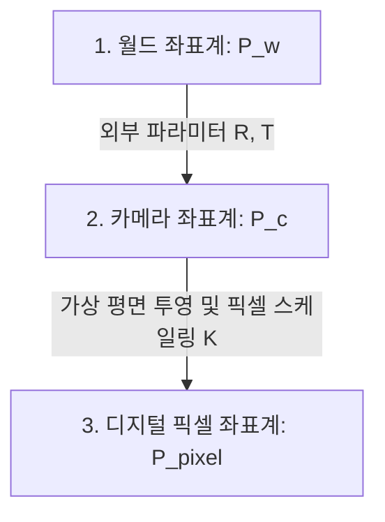

> **시리즈 시작에 앞서**
> 이 시리즈는 Stanford CS231A 강의 노트를 바탕으로 컴퓨터 비전의 수학적 기초를 정리합니다.
> 카메라가 3D 세계를 2D 이미지로 어떻게 변환하는지, 그 원리를 직관적인 시각 자료, 흥미로운 비유와 함께 차근차근 살펴봅니다.

---

## 1. 소개

카메라는 컴퓨터 비전에서 가장 핵심적인 도구입니다. 우리 주변의 3차원 세계를 기록하고, 그 결과물인 2차원 사진을 분석하는 메커니즘이죠. 따라서 컴퓨터 비전의 첫 번째 질문은 자연스럽게 이것이 됩니다.

> 💡 **핵심 직관**: **"3D 공간 속의 입체적인 사물을 2D 모니터 화면의 픽셀 좌표로 어떻게 수학적으로 연결할 것인가?"**

이 질문에 답하기 위해 3차원 세계 좌표계에서부터 출발해 디지털 이미지 픽셀 좌표계에 도달하는 아름다운 수학적 여정을 떠나보겠습니다.

---

## 2. 핀홀 카메라 (Pinhole Camera)

### 2.1 기본 원리

> 🌟 **친절한 비유 (마법의 구멍 장벽)**
> 
> 암흑 속에 사방팔방으로 흩어지는 무수히 많은 빛줄기가 이미지 센서(필름) 위에 마구잡이로 닿는다면, 필름은 온통 하얗게 타버려 형체를 알아볼 수 없을 것입니다.
> 
> 이때, 물체와 필름 사이에 **아주 작은 바늘구멍(Pinhole)이 뚫린 장벽**을 놓으면 어떻게 될까요? 물체의 한 점에서 뿜어져 나오는 수천 갈래의 빛줄기 중 **바늘구멍을 통과하는 오직 단 하나의 곧은 빛줄기**만 필름의 특정 위치에 닿게 됩니다.
> 
> 이 덕분에 3D 세계의 한 점과 2D 필름의 한 점 사이에 명확한 **일대일 대응 관계**가 성립하며 선명한 상이 맺히게 됩니다. 이것이 핀홀 카메라의 직관적인 원리입니다.

```
      [ 3D 세계의 물체 ]                       [ 핀홀 장벽 ]      [ 이미지 평면 (망막) ]
           
            * P (x, y, z)
             \
              \
               \
  -------------\----------------------------------|---------------------------------
                \                                 |             
                 \                                |             
                  \                               |             
                   \                              |             
                    v  빛줄기가 일직선으로 통과       |             
                   [ 핀홀 O ] -------------------->|------------* P' (x', y') 
                    (카메라 중심)                 |             (상이 상하좌우로 뒤집힘)
                   /                              |             
                  /                               |             
                 /                                |             
  --------------/---------------------------------|---------------------------------
               /
              /
             * Q
```

### 2.2 수학적 구성

수식으로 형식화하기 위해 카메라 내부 좌표계를 정의합니다.

- **망막 평면(Retinal Plane) / 이미지 평면(Image Plane)**: 빛이 모여 실제로 상이 맺히는 필름 평면입니다.
- **핀홀 O (카메라 중심, Center of Camera)**: 빛이 통과하는 유일한 중심점으로, 카메라 좌표계의 **원점 $(0,0,0)$**으로 삼습니다.
- **초점 거리 f (Focal Length)**: 핀홀 $O$에서 이미지 평면까지의 물리적 거리입니다.
- **광축 (Optical Axis)**: 핀홀 $O$에서 이미지 평면에 수직으로 뻗어나가는 축이며, 카메라 좌표계에서는 주로 **$z$축**으로 정의됩니다.

> 🪟 **가상 이미지 평면(Virtual Image Plane)이란?**
>
> 실제 핀홀 카메라는 빛이 교차하여 이미지 평면에 상이 거꾸로(상하좌우 반전) 맺힙니다. 이를 수학적으로 다루기 편리하게 만들기 위해, **핀홀 $O$의 '앞쪽'에 거리 $f$만큼 떨어진 가상의 이미지 평면**을 머릿속에 두는 것입니다. 
> 
> 마치 *"눈앞에 투명한 스케치북을 대고 세상을 그대로 그리는 것"*과 같습니다. 이 가상 이미지 평면 위에 맺히는 상은 뒤집히지 않은 온전한 방향을 유지하므로 계산이 훨씬 직관적입니다.

### 2.3 투영 방정식 (Projection Equation)

3D 공간의 점 $P = \begin{bmatrix} x & y & z \end{bmatrix}^T$가 이미지 평면의 점 $P' = \begin{bmatrix} x' & y' \end{bmatrix}^T$로 투영될 때의 관계는 **닮은 삼각형**의 원리로 아주 쉽게 유도됩니다.

$$\frac{x'}{f} = \frac{x}{z} \quad \Rightarrow \quad x' = f\frac{x}{z}$$
$$\frac{y'}{f} = \frac{y}{z} \quad \Rightarrow \quad y' = f\frac{y}{z}$$

이를 벡터 형식으로 쓰면 다음과 같습니다.

$$P' = \begin{bmatrix} x' \\ y' \end{bmatrix} = \begin{bmatrix} f\dfrac{x}{z} \\ f\dfrac{y}{z} \end{bmatrix} \tag{1}$$

### 2.4 조리개 크기의 영향

현실의 카메라는 단 한 점의 핀홀 대신 일정한 크기를 가진 **조리개(Aperture)**를 가집니다. 조리개의 크기는 이미지에 다음과 같은 딜레마를 낳습니다.

| 조리개(바늘구멍) 크기 | 장점 | 단점 | 물리적 직관 |
|---|---|---|---|
| **커질수록 (Large)** | 빛이 많이 들어와 **밝은** 이미지를 얻을 수 있음 | 여러 갈래의 빛이 겹쳐서 **흐려짐 (Blur)** | 3D 한 점에서 온 다양한 빛줄기가 한 픽셀에 동시 도달 |
| **작아질수록 (Small)** | 빛이 걸러져 매우 **선명한** 이미지를 얻을 수 있음 | 빛의 양이 부족해 **어두워짐** | 빛의 회절 한계 및 노이즈 증가 |

---

## 3. 카메라와 렌즈 (Cameras and Lenses)

### 3.1 렌즈의 역할: 핀홀의 한계 극복

현대 카메라는 "선명하면서도 밝은 이미지를 어떻게 얻을 수 있을까?"라는 질문을 해결하기 위해 **렌즈(Lens)**를 도입합니다.

적절한 굴절률을 가진 렌즈는 물체의 한 점 $P$에서 퍼져나가는 **수많은 빛줄기를 굴절시켜 이미지 평면의 딱 한 점 $P'$로 다시 모아줍니다.** 이로써 조리개가 넓어도 선명하고 밝은 사진을 찍을 수 있게 됩니다.

> 📸 **피사계 심도 (Depth of Field)의 탄생**
>
> 렌즈가 빛을 한 점으로 모아주는 마법은 **특정 거리(깊이)에 있는 피사체**에만 완벽하게 작동합니다. 그보다 너무 가깝거나 너무 먼 거리에 있는 물체는 초점이 어긋나 이미지 평면에서 둥글게 번지는 상(Boheh)을 만듭니다. 이를 컴퓨터 그래픽스나 사진학에서 **피사계 심도(아웃포커싱)**라고 부릅니다.

### 3.2 박막 렌즈 근사 (Thin Lens Approximation)

광학계에서 가장 단순한 모델인 **박막 렌즈 근사**에 따르면, 렌즈 중심과 초점 사이의 거리를 **초점 거리 $f$**라 할 때, 3D 점의 깊이 $z$와 상이 맺히는 깊이 $z'$ 사이에는 다음과 같은 광학 공식이 성립합니다.

$$\frac{1}{f} = \frac{1}{z} + \frac{1}{z'} \quad \Rightarrow \quad z' = \frac{fz}{z - f} = f + \frac{f^2}{z-f}$$

이 모델은 광축에 가까운 빛줄기만 고려하는 **파축 굴절 모델(Paraxial Refraction Model)**로도 알려져 있습니다. 물체의 깊이 $z$가 매우 멀어지면($z \to \infty$), 상이 맺히는 위치 $z'$는 물리적 초점 거리 $f$로 수렴하여 핀홀 카메라 모델과 완벽하게 일치하게 됩니다.

### 3.3 방사형 왜곡 (Radial Distortion)

현실의 유리 렌즈는 완벽한 평면 굴절이 불가능하기 때문에 수차와 왜곡을 유도합니다. 가장 대표적인 왜곡이 광축 중심으로부터 거리가 멀어질수록 배율이 변하는 **방사형 왜곡(Radial Distortion)**입니다.

- **배럴 왜곡 (Barrel Distortion)**: 광축에서 먼 곳으로 갈수록 이미지가 오목하게 압축되어 항아리처럼 불룩해지는 왜곡 (주로 광각 렌즈나 어안 렌즈에서 발생).
- **핀쿠션 왜곡 (Pincushion Distortion)**: 광축에서 멀어질수록 이미지가 바깥쪽으로 잡아당겨져 쿠션 모서리처럼 뾰족해지는 왜곡 (망원 렌즈에서 주로 발생).

---

## 4. 디지털 이미지 공간으로 (Going to Digital Image Space)

수학적 투영 관계 $\begin{bmatrix} x & y & z \end{bmatrix}^T \to \begin{bmatrix} x' & y' \end{bmatrix}^T$를 실제 우리가 다루는 디지털 센서(픽셀 좌표)와 완전히 연동하기 위해서는 다음과 같은 **현실적인 좌표 보정**이 추가로 필요합니다.

### 4.1 카메라 내부 파라미터 (Intrinsic Parameters)

```
[ 물리적 가상 이미지 평면 ]                       [ 디지털 이미지 픽셀 평면 ]
(원점이 렌즈 중심 C'에 있음)                        (원점이 이미지 좌상단/좌하단 구석에 있음)

          y'                                        v (픽셀 행)
          ^                                         |
          |                                         v ------> u (픽셀 열)
          |                                        |
          C'------> x'                             |       * P_pixel (u, v)
                                                   |       (픽셀 오프셋 cx, cy 및
                                                   |        픽셀 물리 크기 k, l 반영)
```

1. **원점 오프셋 $(c_x, c_y)$**: 물리적 이미지 좌표계의 원점은 렌즈 중심인 광축($C'$)에 있지만, 실제 디지털 이미지의 원점 $(0,0)$은 화면의 **좌측 상단(또는 하단) 모서리**에 있습니다. 따라서 중심을 맞춰주기 위해 $\begin{bmatrix} c_x & c_y \end{bmatrix}^T$ 만큼의 평행 이동(오프셋)을 적용합니다.
2. **픽셀 단위 변환 $k, l$**: 물리적 센서의 좌표 단위는 센티미터(cm)나 밀리미터(mm)이지만, 우리 코드에 입력되는 단위는 **픽셀(Pixel)**입니다. $1\text{cm}$ 안에 픽셀이 가로로 $k$개, 세로로 $l$개 들어있다고 하면, 물리적 좌표에 가로 배율 $k$, 세로 배율 $l$을 곱해주어야 합니다.
   - $\alpha = f \cdot k$ : 픽셀 단위로 환산된 가로 초점 거리
   - $\beta = f \cdot l$ : 픽셀 단위로 환산된 세로 초점 거리

이를 반영하면 투영 방정식은 다음과 같이 수정됩니다.

$$u = \alpha \frac{x}{z} + c_x, \quad v = \beta \frac{y}{z} + c_y \tag{2}$$

이 식은 분모에 $z$가 들어가기 때문에 **비선형 나눗셈 연산**이 포함되어 있어 선형 대수학(행렬 곱셈)으로 다루기 까다롭습니다. 이 문제를 해결해 주는 멋진 도구가 바로 동차 좌표계입니다.

---

### 4.2 동차 좌표계 (Homogeneous Coordinates)

> 🔦 **친절한 비유 (그림자 놀이)**
>
> 2차원 평면의 좌표 $(x, y)$ 뒤에 가상의 차원 $w$를 덧붙여 **$(x, y, w)$**로 표현하는 것을 동차 좌표계라고 합니다. 
> 
> 기하학적 직관으로 설명하자면, 우리가 사는 3차원 공간 속에서 **광학 원점(손전등)에서 뿜어져 나오는 광선**을 의미합니다. 손전등 빛이 벽(평면 $w=1$)에 부딪혀 만드는 그림자가 바로 우리가 인지하는 유클리드 좌표입니다. 
> 
> 만약 3차원 광선 좌표가 $(2x, 2y, 2)$라면, 벽면 $w=1$에 드리운 그림자는 벽면과 광선이 교차하는 점인 $(x, y, 1)$이 됩니다. 즉, **비율이 같으면 모두 2D 상에서 같은 점으로 투영**되는 마법 같은 성질을 갖습니다.

- **유클리드 $\to$ 동차**: 차원을 하나 늘리고 $1$을 추가합니다: $\begin{bmatrix} x \\ y \end{bmatrix} \to \begin{bmatrix} x \\ y \\ 1 \end{bmatrix}$
- **동차 $\to$ 유클리드**: 마지막 차원의 값 $w$로 앞선 좌표들을 모두 나눕니다: $\begin{bmatrix} x \\ y \\ w \end{bmatrix} \to \begin{bmatrix} x/w \\ y/w \end{bmatrix}$

이 동차 좌표계를 도입하면, 식 (2)의 비선형 나눗셈 연산을 놀랍게도 **순수한 선형 행렬 곱셈**으로 바꿀 수 있습니다!

$$\begin{bmatrix} u' \\ v' \\ w' \end{bmatrix} = \begin{bmatrix} \alpha & 0 & c_x & 0 \\ 0 & \beta & c_y & 0 \\ 0 & 0 & 1 & 0 \end{bmatrix} \begin{bmatrix} x \\ y \\ z \\ 1 \end{bmatrix} \tag{3}$$

최종적으로 $w' = z$가 되므로, 이 동차 벡터를 다시 유클리드 좌표로 환산하기 위해 $w'(=z)$로 나눠주면 정확하게 식 (2)의 투영 방정식이 완벽하게 복원됩니다!

이 행렬 식을 예쁘게 분해해 볼까요?

$$P' = \begin{bmatrix} \alpha & 0 & c_x \\ 0 & \beta & c_y \\ 0 & 0 & 1 \end{bmatrix} \begin{bmatrix} I_{3\times3} & \mathbf{0}_{3\times1} \end{bmatrix} P_{homogeneous} = K \begin{bmatrix} I & \mathbf{0} \end{bmatrix} P \tag{4}$$

여기서 $3 \times 3$ 행렬 **$K$**를 **카메라 내부 파라미터 행렬 (Camera Intrinsic Matrix)**이라 부릅니다. 

#### 스큐(Skewness) 파라미터 추가
만약 이미지 센서가 완벽하게 수직으로 고정되지 않고 아주 미세하게 평행사변형 형태로 비뚤어져 있다면, 두 축 사이의 각도 $\theta$에 의한 스큐 계수(Skewness, $s$)가 행렬의 $(1,2)$ 원소에 추가됩니다.

$$K = \begin{bmatrix} \alpha & s & c_x \\ 0 & \beta & c_y \\ 0 & 0 & 1 \end{bmatrix} \tag{5}$$

> 📌 **내부 파라미터 행렬 $K$의 자유도(DoF)는 총 5개입니다.**
> - 가로/세로 초점 거리 ($\alpha, \beta$) : 2개
> - 이미지 주점 좌표 ($c_x, c_y$) : 2개
> - 센서 스큐 계수 ($s$) : 1개

---

### 4.3 카메라 외부 파라미터 (Extrinsic Parameters)

우리가 바라보는 피사체의 좌표가 항상 카메라 중심을 원점으로 주어지지는 않습니다. 예를 들어 카메라가 움직이거나, 방 한구석을 원점(월드 좌표계)으로 삼았을 때가 훨씬 흔하죠. 

따라서 **월드 기준 좌표계의 점 $P_w$를 카메라 기준 좌표계의 점 $P_c$로 회전($R$)시키고 이동($T$)시키는 변환**이 추가로 들어갑니다.

$$P_c = R P_w + T = \begin{bmatrix} R & T \\ \mathbf{0}^T & 1 \end{bmatrix} P_{w, homogeneous} \tag{6}$$

- **$R$ (Rotation Matrix)**: $3 \times 3$ 크기의 직교 행렬이며, 자유도는 3(롤, 피치, 요 각도)입니다.
- **$T$ (Translation Vector)**: $3 \times 1$ 크기의 변위 벡터이며, 자유도는 3입니다.

이를 최종 카메라 투영 방정식에 대입하면 다음과 같은 컴퓨터 비전의 위대한 기초 공식이 탄생합니다.

$$P' = K \begin{bmatrix} R & T \end{bmatrix} P_w = M P_w \tag{7}$$

여기서 $3 \times 4$ 행렬 **$M = K \begin{bmatrix} R & T \end{bmatrix}$**을 **전체 투영 행렬 (Projection Matrix)**이라 부릅니다.

> 📝 **투영 행렬 $M$의 자유도(DoF) 심층 분석**
> 
> $M$은 물리적으로 **총 11개의 자유도**를 가집니다.
> - 내부 파라미터 ($K$): 5개 자유도
> - 외부 파라미터 ($R, T$): 6개 자유도 (회전 3개 + 이동 3개)
> - *질문*: $3 \times 4$ 행렬은 원래 원소가 12개인데, 왜 자유도가 11개일까요?
> - *답변*: 동차 좌표계의 특성상 전체 행렬에 임의의 상수 스케일 $k$를 곱해도 투영 결과는 동일하기 때문에, 스케일 자유도 1개가 빠져 **$12 - 1 = 11$**이 됩니다.



---

## 5. 카메라 캘리브레이션 (Camera Calibration)

카메라가 3D 세계를 사진으로 바꿀 때 쓰는 비밀 지도($M$)를 알았으니, 이제 역으로 **알려지지 않은 카메라가 주어졌을 때 이미지 속 정보를 분석해 역으로 $M$과 $K$를 알아내는 문제**를 다뤄야 합니다. 이를 **카메라 캘리브레이션**이라 합니다.

### 5.1 캘리브레이션 리그 (Calibration Rig)

치수를 정밀하게 알고 있는 격자 무늬(예: 체커보드) 판인 **캘리브레이션 리그**를 세워놓고 사진을 찍습니다.
- 우리는 리그의 물리적 구조를 잘 알기 때문에 3D 월드 상의 격자 교차점 $P_1, \ldots, P_n$을 정확히 알고 있습니다.
- 이미지 처리 코너 검출(Corner Detection)을 통해 해당 점들이 찍힌 2D 이미지 픽셀 좌표 $p_1, \ldots, p_n$을 검출합니다.

### 5.2 선형 연립방정식(DLT)의 구축

식 (7)로부터 각 대응점 쌍 ($P_i \leftrightarrow p_i$)에 대해 다음 관계가 수립됩니다. $p_i = \begin{bmatrix} u_i & v_i & 1 \end{bmatrix}^T$라 하고, 행렬 $M$의 행벡터들을 $m_1^T, m_2^T, m_3^T$라 하면:

$$u_i = \frac{m_1^T P_i}{m_3^T P_i}, \quad v_i = \frac{m_2^T P_i}{m_3^T P_i}$$

양변에 분모를 곱해 정리하면 각 매칭점 당 **2개의 아름다운 선형 제약 식**이 탄생합니다.

$$u_i(m_3^T P_i) - m_1^T P_i = 0$$
$$v_i(m_3^T P_i) - m_2^T P_i = 0$$

$n$개의 매칭점 정보를 쫙 모아서 $12 \times 1$ 크기로 길게 늘어뜨린 미지수 벡터 $m = \begin{bmatrix} m_1^T & m_2^T & m_3^T \end{bmatrix}^T$에 대한 거대한 행렬곱 연립방정식 $\mathbf{P} m = \mathbf{0}$을 구축합니다.

$$\begin{bmatrix} P_1^T & \mathbf{0}^T & -u_1 P_1^T \\ \mathbf{0}^T & P_1^T & -v_1 P_1^T \\ \vdots & \vdots & \vdots \\ P_n^T & \mathbf{0}^T & -u_n P_n^T \\ \mathbf{0}^T & P_n^T & -v_n P_n^T \end{bmatrix} \begin{bmatrix} m_1 \\ m_2 \\ m_3 \end{bmatrix} = \mathbf{P}m = \mathbf{0} \tag{8}$$

> 💡 **최소 몇 개의 대응점이 필요할까?**
>
> 행렬 $M$의 자유도가 11개이므로, 매칭점 1개당 2개의 방정식을 얻기 때문에 우리는 **최소 6개의 대응점**이 있다면 이 연립방정식을 온전히 풀 수 있습니다 ($2n \geq 11$).

---

### 5.3 SVD를 이용한 수학적 풀이

실제 센서 측정에는 미세한 노이즈가 있기 때문에, $\mathbf{P}m = \mathbf{0}$을 완벽하게 만족하는 $m$은 존재하지 않습니다. 따라서 우리는 대수적 오차의 제곱합 $\|\mathbf{P}m\|^2$을 최소화하는 최적의 해를 찾아내야 합니다.

$$\underset{m}{\text{minimize}} \quad \|\mathbf{P}m\|^2 \quad \text{subject to} \quad \|m\|^2 = 1 \tag{9}$$

이 문제는 **특이값 분해 (Singular Value Decomposition, SVD)**로 매우 우아하게 풀립니다. 

$$\mathbf{P} = U D V^T$$

> 🧠 **수학적 직관 노트: SVD의 물리적 의미**
> 
> 대칭행렬 $\mathbf{P}^T \mathbf{P}$의 고유값 분해 관점에서 볼 때, 특이값 분해는 행렬 $\mathbf{P}$가 가진 변형 에너지의 축들을 크기 순서대로 정렬해 줍니다. 
> 
> 우리가 원하는 해는 전체 행렬의 에너지를 가장 **최소한으로 찌그러트리는(0에 가깝게 만드는) 최약체 방향의 축**입니다. 따라서 $D$에서 가장 작은 특이값에 해당하는 **우특이행렬 $V$의 가장 마지막 열 벡터**가 바로 우리가 원하던 최적의 최소제곱 오차 해 $m$이 됩니다.

---

### 5.4 내부/외부 파라미터의 기하학적 복원

SVD로 구한 벡터 $m$을 다시 $3 \times 4$ 행렬 $M = \begin{bmatrix} A & b \end{bmatrix}$로 재배치합니다. 실제 투영 행렬은 구한 행렬의 특정 스케일 $\rho$ 배이므로 이를 분해해 나갑니다.

$$\rho \begin{bmatrix} A & b \end{bmatrix} = K \begin{bmatrix} R & T \end{bmatrix}$$

$A$의 행벡터들을 $a_1^T, a_2^T, a_3^T$라 할 때, 직교 행렬 $R$의 성질($\|r_3\| = 1$ 등)을 이용해 내부 파라미터를 역추적할 수 있습니다.

$$\rho = \pm \frac{1}{\|a_3\|}$$
$$c_x = \rho^2 (a_1 \cdot a_3), \quad c_y = \rho^2 (a_2 \cdot a_3)$$
$$\cos\theta = -\frac{(a_1 \times a_3) \cdot (a_2 \times a_3)}{\|a_1 \times a_3\| \cdot \|a_2 \times a_3\|}$$

여기서 $\theta$는 카메라 센서의 비틀림 각도로서 스큐 계수와 연동되며, 가로/세로 초점 거리는 다음과 같이 온전히 구해집니다.

$$\alpha = \rho^2 \|a_1 \times a_3\| \sin\theta, \quad \beta = \rho^2 \|a_2 \times a_3\| \sin\theta \tag{10}$$

외부 파라미터 회전 행렬 $R$과 이동 벡터 $T$ 역시 내부 파라미터 정보를 이용해 단계적으로 완벽히 추출해낼 수 있습니다.

$$r_1 = \frac{a_2 \times a_3}{\|a_2 \times a_3\|}, \quad r_2 = r_3 \times r_1, \quad r_3 = \rho a_3, \quad T = \rho K^{-1} b \tag{11}$$

---

### 5.5 퇴화 구성 (Degenerate Configurations): 캘리브레이션의 덫

이론적으로는 6개의 대응점만 있으면 파라미터 복원이 가능하지만, 만약 6개의 점들이 **동일한 평면 위에 놓여 있거나** 특수한 입체 곡면 위에 배열되어 있는 상황(이를 **퇴화 구성**이라 함)이라면 방정식 행렬의 랭크(Rank)가 부족해져 고유한 해를 구할 수 없게 됩니다. 

따라서 실제 캘리브레이션 체커보드를 배치할 때는 평면을 다양한 각도와 깊이로 입체감 있게 여러 장 촬영하여 이러한 수학적 덫을 피해 갑니다.

---

## 부록 A: 다양한 카메라 모델 (Different Camera Models)

가장 이상적인 카메라는 원근감이 나타나는 핀홀 모델이지만, 특정한 상황(멀리 있는 사물을 당겨 찍을 때 등)에서는 수학을 대폭 단순화하기 위해 다음과 같은 대안 모델을 적용합니다.

### A.1 약 원근 모델 (Weak Perspective Model)

> 🔭 **친절한 비유 (원거리 망원 렌즈)**
>
> 아주 멀리서 달을 바라보며 달 위에 있는 토끼와 크레이터들의 깊이 차이를 잰다고 해봅시다. 달 자체의 깊이에 비해 표면 굴곡의 깊이 차이는 사실상 거의 $0$에 수렴할 만큼 미미합니다.
> 
> 이럴 때는 물체의 깊이 차이에 의한 원근 효과를 과감히 무시하고, 모든 점의 깊이를 대표 거리 $z_o$로 통일해 줍니다. 
> 
> 마치 *"모든 3D 점들을 하나의 가상 평면에 수직으로 먼저 도장을 찍은 뒤(직교 투영), 일정한 스케일 비율로 이미지에 올리는 것"*과 같습니다.

$$x' = \frac{f}{z_0} x, \quad y' = \frac{f}{z_0} y \tag{12}$$

이 경우 투영 행렬의 마지막 행은 더 이상 미지수가 섞인 $\begin{bmatrix} v & 1 \end{bmatrix}$이 아니라 단순한 $\begin{bmatrix} 0 & 0 & 0 & 1 \end{bmatrix}$이 되므로 비선형 나눗셈 연산이 완전히 사라져 계산이 비약적으로 단순해집니다.

### A.2 직교 투영 모델 (Orthographic Projection Model)

약 원근 모델에서 대표 거리 $z_0$ 조차 아예 $1$로 단순화시켜 깊이를 완전히 배제한 투영입니다.

$$x' = x, \quad y' = y \tag{13}$$

물체의 실제 물리적 크기가 이미지에 크기 왜곡 없이 $1:1$로 기록되므로, 정밀 설계 도면을 다루는 건축 설계나 산업용 기계 CAD 등에서 즐겨 사용됩니다.
