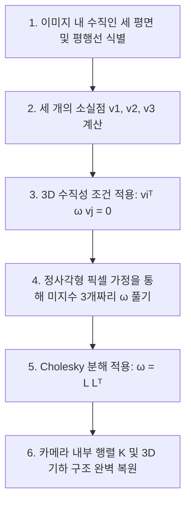

> 이전 편에서는 카메라의 내부/외부 파라미터를 이용해 3D 세계를 2D 이미지로 변환하는 방법을 살펴봤습니다. 이번에는 흥미진진한 반대 방향의 문제를 다룹니다.
>
> 💡 **질문**: **"카메라 파라미터를 모르는 상태에서, 단 한 장의 사진만으로 3D 세계의 실제 구조를 자대고 측량하듯 복원해낼 수 있을까?"**

---

## 1. 소개

2차원 이미지 속에 비친 사물들의 비율과 실제 3차원 공간 속 길이를 연결하는 비밀 열쇠를 찾기 위해서는, 먼저 2D 평면 상에서 일어나는 다양한 기하학적 변환들을 이해해야 합니다. 이 변환들은 마치 사다리처럼 **보존되는 물리적 성질에 따라 철저한 계층 구조**를 이룹니다.

---

## 2. 2D 변환의 계층 구조 (Hierarchy of 2D Transformations)

> 🧸 **친절한 비유 (재질과 힘에 따른 평면의 변형)**
> 
> 우리가 평면 종이를 다양한 재질의 패드로 바꾼 뒤 힘을 가한다고 비유해 보겠습니다.
> 
> 1. **등거리 변환 (Isometric)**: 아주 **단단한 플라스틱 카드**입니다. 카드를 바닥에서 아무리 회전시키고 밀어도(이동), 카드 고유의 모양과 크기, 즉 **모든 점들 사이의 물리적 거리는 절대로 변하지 않습니다.**
> 2. **유사 변환 (Similarity)**: 신축성 있는 **고무줄 평면**입니다. 고무줄을 잡고 사방으로 똑같은 힘으로 늘리면, 전체 크기는 늘어날지언정 물체 고유의 **형태(각도, 길이 비율)는 완벽하게 유지**됩니다.
> 3. **아핀 변환 (Affine)**: 부드러운 **실리콘 패드**입니다. 패드의 윗부분만 잡고 옆으로 쭉 비틀어(전단 변형, Shearing) 밀면, 사각형이 평행사변형이 됩니다. 각도는 깨지지만, **평행하던 두 선은 여전히 평행**을 유지합니다.
> 4. **사영 변환 (Projective)**: 어두운 방에서 **투명 시트지에 손전등을 비추어 벽면에 드리우는 그림자**입니다. 손전등을 삐딱하게 비추면 평행하던 선들도 한 점으로 좁아지며 평행성이 완전히 깨집니다. 오직 **선이 꺾이지 않고 곧은 선(직선)으로 유지된다는 성질**만 살아남습니다.

```
[ 등거리: 단단한 카드 ]     [ 유사: 고무줄 균등 확장 ]     [ 아핀: 평행사변형 비틀기 ]     [ 사영: 삐딱한 그림자 ]
     ┌───┐                      ┌──────┐                     ┌──────┐                        /───/
     │   │                      │      │                    /      /                       /   /
     └───┘                      └──────┘                   /      /                       /___/
(거리, 각도 보존)             (각도, 비율 보존)            (평행성 보존)               (직선성만 보존)
```

### 2.1 수학적 정의 및 보존 성질

각 변환은 동차 좌표계에서 정방행렬과의 곱으로 매우 정교하게 정의됩니다.

#### 등거리 변환 (Isometric Transformations)
회전 행렬 $R$($2 \times 2$ 직교 행렬)과 이동 벡터 $t$($2 \times 1$)로 구성되며, 자유도는 3입니다.

$$\begin{bmatrix} x' \\ y' \\ 1 \end{bmatrix} = \begin{bmatrix} R & t \\ \mathbf{0}^T & 1 \end{bmatrix} \begin{bmatrix} x \\ y \\ 1 \end{bmatrix}$$

#### 유사 변환 (Similarity Transformations)
등거리 변환에 균등 스케일링 인자 $s$가 추가되며, 자유도는 4입니다.

$$\begin{bmatrix} x' \\ y' \\ 1 \end{bmatrix} = \begin{bmatrix} sR & t \\ \mathbf{0}^T & 1 \end{bmatrix} \begin{bmatrix} x \\ y \\ 1 \end{bmatrix}$$

#### 아핀 변환 (Affine Transformations)
임의의 $2 \times 2$ 비특이 행렬 $A$와 이동 벡터 $t$로 구성되며, 자유도는 6입니다. 평행성(Parallelism)과 면적의 비율이 보존됩니다.

$$\begin{bmatrix} x' \\ y' \\ 1 \end{bmatrix} = \begin{bmatrix} A & t \\ \mathbf{0}^T & 1 \end{bmatrix} \begin{bmatrix} x \\ y \\ 1 \end{bmatrix}$$

#### 사영 변환 / 호모그래피 (Projective Transformations / Homographies)
가장 일반적인 선형 변환으로, 임의의 $3 \times 3$ 행렬 $H$로 표현되며 자유도는 8입니다. 평행성은 보존되지 않지만 **점들의 일직선성(Collinearity)**이 유지됩니다.

$$\begin{bmatrix} x' \\ y' \\ 1 \end{bmatrix} = \begin{bmatrix} A & t \\ \mathbf{v}^T & v \end{bmatrix} \begin{bmatrix} x \\ y \\ 1 \end{bmatrix} = H \begin{bmatrix} x \\ y \\ 1 \end{bmatrix}$$

#### 💡 불변의 아름다움: 교차비 (Cross Ratio)
사영 변환 하에서 평행성마저 모두 깨지지만, 한 직선 위의 네 점 $P_1, P_2, P_3, P_4$에 대해 절대 변하지 않는 상수가 있습니다. 이를 **교차비**라 합니다.

$$\text{cross ratio} = \frac{\|P_3 - P_1\| \|P_4 - P_2\|}{\|P_3 - P_2\| \|P_4 - P_1\|} \tag{1}$$

사진 속에서 찌그러진 네 점의 간격을 보고 실제 3D 세계의 비율을 역추적할 수 있는 아주 강력한 수학적 뼈대입니다.

---

## 3. 무한의 점과 선 (Points and Lines at Infinity)

### 3.1 2D 직선의 동차 표현

동차 좌표계에서 2D 공간의 **직선**은 아주 흥미롭게도 점과 동일한 $3 \times 1$ 벡터 $\ell = \begin{bmatrix} a & b & c \end{bmatrix}^T$로 표현됩니다. 
물리적 직선 방정식 $ax + by + c = 0$에 점 $p = \begin{bmatrix} x & y & 1 \end{bmatrix}^T$를 대입해 보면, 두 동차 벡터의 내적식으로 완벽히 표현됨을 알 수 있습니다.

$$p^T \ell = \begin{bmatrix} x & y & 1 \end{bmatrix} \begin{bmatrix} a \\ b \\ c \end{bmatrix} = ax + by + c = 0 \tag{2}$$

#### 🧠 수학적 직관: 두 직선의 교점은 왜 외적일까?
일반적으로 두 직선 $\ell$과 $\ell'$은 하나의 점 $x$에서 만납니다. 이 교점 $x$는 놀랍게도 두 직선 벡터의 **외적(Cross Product)**인 $x = \ell \times \ell'$로 바로 구해집니다.
- *증명*: 외적의 정의에 따라 벡터 $x$는 원래의 두 벡터 $\ell$과 $\ell'$에 동시에 수직입니다. 즉, $\ell^T x = 0$ 이고 $\ell'^T x = 0$ 입니다. 이는 점 $x$가 두 직선 위에 동시에 놓여있다는 뜻이 되므로, 기하학적으로 **두 직선의 유일한 교점**이 될 수밖에 없습니다! $\square$

---

### 3.2 무한점 (Points at Infinity)과 평행선의 만남

> 🛤️ **친절한 비유 (끝없는 기찻길)**
> 
> "평행한 두 선은 영원히 만나지 않는다"는 것이 유클리드 기하학의 정의입니다. 
> 하지만 우리가 탁 트인 벌판에서 곧게 뻗은 기찻길을 바라보면, 평행한 두 선로가 저 멀리 **지평선의 한 점**에서 서로 만나는 것처럼 보입니다.
> 
> 동차 좌표계는 이 직관을 고스란히 담아, **"평행선은 우주의 끝인 '무한대'에서 결국 교차한다"**고 정의합니다. 이때 교차하는 가상의 점을 **무한점** 또는 **이상점(Ideal Point)**이라 부릅니다.

동차 좌표계에서 무한점은 마지막 차원 $w=0$을 갖는 **$\begin{bmatrix} x & y & 0 \end{bmatrix}^T$**의 형태입니다. 유클리드 좌표계로 바꾸기 위해 $0$으로 나누는 순간 무한대($\infty$)로 뻗어 나가는 원리입니다.

실제로 평행한 두 직선 $\ell = \begin{bmatrix} a & b & c \end{bmatrix}^T$와 $\ell' = \begin{bmatrix} a & b & c' \end{bmatrix}^T$ (기울기가 같음)의 교점을 외적식으로 계산해 보면 다음과 같습니다.

$$\ell \times \ell' \propto \begin{bmatrix} b \\ -a \\ 0 \end{bmatrix} = x_\infty \tag{3}$$

마지막 좌표가 $0$인 무한점 $x_\infty$가 유도됩니다! 기하학적으로 이 무한점의 방향은 두 직선의 기울기 방향인 $(-b/a)$와 완벽하게 일치합니다.

### 3.3 무한선 (Lines at Infinity)
3D 공간의 평행선 쌍들이 가지는 다양한 무한점들($x_{\infty,1}, x_{\infty,2}, \ldots$)을 쫙 모으면, 이 모든 무한점들을 품고 있는 하나의 거대한 직선 **$\ell_\infty$**가 탄생합니다. 이를 **무한선**이라 합니다.

$$\ell_\infty = \begin{bmatrix} 0 & 0 & 1 \end{bmatrix}^T$$

이 무한선은 현실 세계에서는 결코 도달할 수 없는 지평선 너머의 우주 끝 경계선을 뜻합니다. 

> 💡 **사영 변환과 아핀 변환의 극적인 차이**
> 
> - **아핀 변환**은 무한선 $\ell_\infty$를 변환해도 여전히 $\begin{bmatrix} 0 & 0 & 1 \end{bmatrix}^T$, 즉 무한선으로 유지합니다. 평행선이 계속 평행선으로 남는 이유가 여기에 있습니다.
> - 반면, **사영 변환 $H$**는 우주의 끝에 있던 무한선을 **우리가 눈으로 볼 수 있는 유한한 영역의 직선**으로 끌어당겨 매핑할 수 있습니다. 이것이 바로 원근 사진에서 평행선들이 한데 모여 만드는 **소실선(지평선)**의 비밀입니다.

---

## 4. 소실점과 소실선 (Vanishing Points and Lines)

### 4.1 소실점 (Vanishing Point)

3차원 공간 속 평행한 직선들이 저 멀리 무한대에서 만나는 점 $x_\infty$를 카메라로 촬영하면, 2차원 이미지 평면 위의 유한한 점 $v$로 투영됩니다. 이 점을 **소실점**이라 합니다.

카메라 기준 좌표계에서 3D 평행선들이 뻗어나가는 방향 벡터를 $d = \begin{bmatrix} a & b & c \end{bmatrix}^T$라 할 때, 이미지 상의 소실점 $v$는 카메라 내부 파라미터 행렬 $K$와의 곱으로 아주 심플하게 결정됩니다.

$$v = Kd \tag{4}$$

역으로, 사진 속에서 소실점 $v$를 찾아낸다면 3차원 공간 속 평행선들이 실제로 뻗어가고 있었던 진짜 3D 방향 $d$를 복원해낼 수 있습니다!

$$d = \frac{K^{-1}v}{\|K^{-1}v\|} \tag{5}$$

### 4.2 소실선 / 지평선 (Vanishing Line)

3차원 평면 $\Pi$ 위에 무수히 많은 평행선 집합들이 만드는 소실점들을 한 선으로 이으면, 그 평면의 끝 경계선인 **소실선(지평선, Horizon Line)** $\ell_\text{horiz}$가 만들어집니다.

```
       [ 3D 세계의 평행 평면 ]                    [ 2D 이미지 평면 ]
                                                  
         ================== 평행선들                -----------------------------
        /  /  /  /  /  /  /                        \   \   \  |  /   /   / 소실점 v
       /  /  /  /  /  /  /                          \   \   \ | /   /   / 
      /  /  /  /  /  /  /                            \   \   \|/   /   /  
     ================== 3D 평면 ∏                     =========*========= 소실선 ℓ_horiz
                                                      (지평선이 평면의 끝을 알려줌)
```

이 지평선 $\ell_\text{horiz}$와 3차원 평면의 법선 벡터 $n$ 사이에는 매우 강력하고 우아한 기하학적 대칭 관계가 존재합니다.

$$n = K^T \ell_\text{horiz} \tag{6}$$

즉, 사진 속에서 지평선 한 줄만 검출할 수 있다면, 그 넓은 평면이 3차원 공간 상에서 어떤 각도로 누워있는지(법선 방향 $n$)를 정확하게 추정해낼 수 있습니다!

---

### 4.3 소실점으로 각도 계산하기

카메라의 내부 정보($K$ 또는 이미지의 기하학적 매트릭스 $\omega = (KK^T)^{-1}$)를 알고 있다면, 두 소실점을 이용해 3D 공간 속 두 직선 사이의 실제 각도 $\theta$를 계산할 수 있습니다. 

두 소실점을 $v_1$, $v_2$라 할 때, 3D 실제 각도 $\theta$는 다음과 같습니다.

$$\cos\theta = \frac{v_1^T \omega v_2}{\sqrt{v_1^T \omega v_1} \sqrt{v_2^T \omega v_2}} \tag{7}$$

마찬가지로, 두 평면의 소실선 $\ell_1, \ell_2$를 알고 있다면 두 평면 사이의 실제 3D 사잇각 역시 간단하게 구할 수 있습니다.

$$\cos\theta = \frac{\ell_1^T \omega^{-1} \ell_2}{\sqrt{\ell_1^T \omega^{-1} \ell_1} \sqrt{\ell_2^T \omega^{-1} \ell_2}} \tag{8}$$

---

## 5. 단일 뷰 계측 예제 (Single View Metrology Example)

이제 이 기하학적 공식들을 결합하여, **단 한 장의 사진만으로 카메라를 스스로 보정(Self-Calibration)하는 마법 같은 문제**를 풀어보겠습니다.

### 5.1 문제 설정
격자 패턴이나 건축물 사진을 보면, 우리 주변에는 **서로 수직인 세 개의 평면**이 아주 흔하게 존재합니다 (예: 빌딩의 바닥, 왼쪽 벽면, 오른쪽 벽면).
1. 이미지에서 바닥 평면의 평행선 쌍을 찾아 소실점 $v_1$을 구합니다.
2. 왼쪽 벽면의 평행선 쌍을 찾아 소실점 $v_2$를 구합니다.
3. 오른쪽 벽면의 평행선 쌍을 찾아 소실점 $v_3$를 구합니다.

우리는 이 세 방향이 3차원 실제 공간 상에서 **서로 직교(수직, $\theta = 90^\circ$)**한다는 것을 알고 있습니다.

### 5.2 수학적 제약 조건과 캘리브레이션 풀이

두 방향이 수직이면 $\cos(90^\circ) = 0$이므로, 식 (7)의 분자가 $0$이 되어야 합니다. 즉:

$$v_1^T \omega v_2 = 0, \quad v_1^T \omega v_3 = 0, \quad v_2^T \omega v_3 = 0 \tag{9}$$

여기서 미지수는 카메라 주점과 초점 거리를 품고 있는 대칭 행렬 $\omega$입니다. 

- 원래 카메라 내부 행렬 $K$는 5개의 자유도를 가지며, $\omega$ 역시 5개의 자유도를 갖습니다.
- 서로 수직인 세 소실점 쌍이 제공하는 선형 방정식 제약 조건은 총 **3개**입니다.
- 조건이 부족하여 단독으로는 풀 수 없지만, 현대 카메라 센서에 대한 합리적인 가정인 **"정사각형 픽셀(초점 거리가 가로세로 같음) 및 스큐 $0$"**을 도입하면 $\omega$의 미지수가 단 **3개**로 줄어듭니다!

$$\omega = \begin{bmatrix} \omega_1 & 0 & \omega_4 \\ 0 & \omega_1 & \omega_5 \\ \omega_4 & \omega_5 & \omega_6 \end{bmatrix} \tag{10}$$

이제 3개의 연립방정식으로 3개의 미지수를 가진 $\omega$를 완벽하게 계산해낼 수 있습니다.

### 5.3 Cholesky 분해를 통한 최종 복원

구해진 $\omega$는 물리적으로 $\omega = (KK^T)^{-1}$의 형태를 가집니다. $\omega$는 대칭행렬이자 항상 양의 정부호(Positive-Definite) 행렬의 성질을 띠므로, 선형대수학의 **Cholesky 분해(Cholesky Decomposition)**를 사용해 $A^T A$ 형태로 유일하게 쪼갤 수 있습니다.

$$\omega = L L^T$$

$L$은 하삼각행렬이 되며, 이를 역산하면 우리가 그토록 찾아 헤매던 카메라 고유의 내부 파라미터 행렬 **$K$**가 단 한 장의 사진 속에 있던 수직 평면들의 기하학적 제약 조건으로부터 마법같이 복원됩니다!


