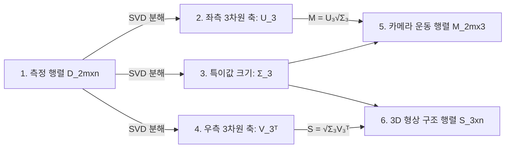

> 이전 편에서 에피폴라 기하학과 기본 행렬을 다루며 두 카메라 간의 기하학적 짝꿍 관계를 분석했습니다. 하지만 아직 3D 장면 자체의 입체적인 형태는 추출하지 못했습니다.
>
> 💡 **질문**: **"여러 장의 2D 이미지와 매칭점을 가지고, 마법처럼 실제 3D 입체 공간 구조(Structure)와 카메라의 움직임 동선(Motion)을 온전히 복원할 수 있을까?"**

---

## 1. 들어가며

우리의 최종 목표는 2차원 평면 세계에서 3차원 깊이 세계를 재구성해내는 것입니다. 이를 달성하기 위해 이번 편에서는 아래의 4가지 핵심 마일스톤을 차례로 달성해 나갑니다.

1. **삼각측량 (Triangulation)**: 알려진 두 카메라의 눈빛(시선)을 모아 3D 위치를 찝어내는 기술
2. **어파인 SfM (Affine SfM)**: 카메라가 멀리 있을 때, Tomasi-Kanade 인수분해를 통해 한번에 카메라 움직임과 물체 형상을 풀어내는 기법
3. **투영 SfM (Perspective SfM)**: 원근법이 포함된 현실 카메라에서 대수적으로 3D 구조를 역추적하는 기법
4. **번들 조정 (Bundle Adjustment)**: 수학적 오차들을 한데 묶어 최종 3D 조각품의 정밀도를 극한으로 깎아내는 전역 최적화

---

## 2. 삼각측량 (Triangulation)

### 2.1 등대 삼각측량과 현실의 오차

> 🗼 **친절한 비유 (어긋나는 두 시선과 타협점)**
> 
> 칠흑같이 어두운 밤바다 위, 두 등대(카메라 1, 카메라 2)에서 바다 위에 떠 있는 한 척의 배(3D 점 $P$)를 발견했습니다.
> 
> 두 등대는 각각 배가 위치한 각도(시선 $\ell_1, \ell_2$)를 측정했습니다. 수학적으로 완벽한 세상이라면, 두 등대가 쏜 빛줄기가 만나는 교차점이 바로 배의 정확한 3차원 위치가 됩니다.
> 
> 그러나 현실은 차가운 노이즈가 존재합니다. 센서의 측정 오차나 픽셀의 이산화 오차 때문에 두 등대가 쏜 빛줄기는 **3차원 허공에서 만나지 못하고 삐딱하게 스쳐 지나가 버립니다.**
> 
> 삼각측량은 이 상황에서 좌절하지 않고, **"서로 어긋난 두 직선 사이의 거리가 가장 가깝게 스쳐 지나가는 최적의 타협점"**을 최소제곱법으로 찾아내어 배의 최종 위치로 낙점하는 기법입니다.

### 2.2 기하 구조 시각화 (ASCII Art)

```
        [ 등대 1 (카메라 O1) ]                      [ 등대 2 (카메라 O2) ]
                 o                                           o
                /                                             \
               /  시선 ℓ1                                      \  시선 ℓ2
              /                                                 \
             /                                                   \
            /                                                     \
           /     * 최적의 타협점 P(x, y, z)                          \
          /      (두 어긋난 직선 사이의 오차를 최소화)                 \
         /  <--------->  <--------------------------------------------->
        /   대수적 오차   거리 최솟값                                     \
       /                                                                 \
      v                                                                   v
   [ 3D 실제 점의 참값 P_true ]                                     [ 빗나간 시선 끝 ]
```

---

### 2.3 선형 삼각측량 방법
두 이미지의 대응점 $p = \begin{bmatrix} u & v & 1 \end{bmatrix}^T$와 $p' = \begin{bmatrix} u' & v' & 1 \end{bmatrix}^T$가 주어졌을 때, 투영 행렬 $M, M'$과의 외적 식은 $p \times (MP) = \mathbf{0}$이 성립합니다. 이를 성분별로 유도하여 $AP = \mathbf{0}$ 형태의 선형 시스템을 구축합니다.

$$A = \begin{bmatrix} u M_3 - M_1 \\ v M_3 - M_2 \\ u' M'_3 - M'_1 \\ v' M'_3 - M'_2 \end{bmatrix} \tag{1}$$

이 시스템을 **SVD(특이값 분해)**를 이용해 대수적으로 풀어내어 빠른 초기 3D 점 $P$를 구합니다. 

---

### 2.4 비선형 삼각측량: 재투영 오차의 최소화

선형 방식은 행렬 나눗셈을 무시한 대수적 근사치이므로 기하학적 정밀도가 떨어집니다. 우리는 실제 카메라 렌즈가 바라보는 시야각 안에서 가장 완벽한 3D 좌표를 찾기 위해, **재투영 오차(Reprojection Error)**를 최소화하는 비선형 최적화 문제를 풉니다.

$$\min_{\hat{P}} \|M\hat{P} - p\|^2 + \|M'\hat{P} - p'\|^2 \tag{2}$$

#### 🏎️ Gauss-Newton 알고리즘과 야코비안(Jacobian)
이 비선형 최소제곱 문제를 해결하기 위해, 현재 추정값 근방에서 곡률을 구하고 아래로 미끄러져 내려가는 **Gauss-Newton** 최적화를 수행합니다.

$$\delta_P = -(J^T J)^{-1} J^T e \tag{3}$$

- **잔차 오차 $e$**: 내가 찍은 가상 3D 점이 픽셀 평면에 투영된 위치와 실제 픽셀 매칭점 사이의 거리 벡터입니다.
- **야코비안 $J$ (곡률의 중력 가속도)**: 3차원 점이 조금 움직일 때, 픽셀 좌표가 어느 방향으로 얼마나 요동치는지 나타내는 **"재투영 오차의 방향 감각 벡터"**입니다. 
- *직관*: $J^T e$는 오차를 줄이기 위해 3D 점을 어느 방향으로 잡아당겨야 할지 알려주는 나침반 역할을 하며, 헤시안 행렬의 근사치인 $(J^T J)^{-1}$은 경사를 타고 미끄러질 때 너무 덜 가거나 미끄러져 튀어 나가지 않도록 똑똑하게 감속/가속해 주는 역할을 합니다.

---

## 3. 어파인 구조로부터의 운동 (Affine SfM)

### 3.1 Tomasi-Kanade 인수분해 (Factorization)

> 🧩 **친절한 비유 (그림자 데이터 속 퍼즐 조각 분리하기)**
> 
> 무대 위에서 3D 댄서($n$개의 점)들이 춤추고 있고, 카메라들($m$개의 카메라)이 여러 각도에서 이 춤을 찍고 있습니다.
> 
> 우리가 가진 유일한 힌트는 카메라들이 기록한 **2차원 픽셀 그림자 데이터(측정 행렬 $D$)**뿐입니다.
> 
> Tomasi-Kanade 인수분해 기법은 이 거대한 2D 그림자 데이터 판($D$)을 선형대수의 고차원 인수분해로 쪼개어, **"카메라들의 일관된 카메라 앵글 움직임(Motion, 행렬 $M$)"**과 **"댄서들이 만드는 입체적인 3D 춤선 형상(Structure, 행렬 $S$)"**이라는 전혀 다른 차원의 두 조각으로 완벽히 분리해내는 아름다운 선형대수 마법입니다.

#### 단계 1: 데이터 중심화 (Data Centering)
각 이미지의 픽셀 좌표에서 무게중심을 빼주어(Zero-centering), 이미지 상의 이동 오프셋 $b_i$를 완전히 소거합니다. 이로써 오직 순수한 회전 변환만으로 구성된 선형 시스템을 확립합니다.

$$\hat{x}_{ij} = A_i \hat{X}_j \tag{4}$$

#### 단계 2: 측정 행렬 $D$의 SVD 인수분해

모든 카메라와 모든 3D 점 매칭 정보 $mn$개를 집대성한 $2m \times n$ 크기의 거대한 측정 행렬 $D$를 만듭니다. 어파인 기하학 조건에 의해, 이 거대한 행렬 $D$의 고유 정보 랭크는 물리적으로 **랭크 3**을 넘을 수 없습니다 ($\text{rank}(D) = 3$).

SVD를 이용하여 이 행렬을 가장 영향력 있는 3차원 공간 축으로 인수분해합니다.

$$D \approx U_3 \Sigma_3 V_3^T \tag{5}$$



### 3.2 재구성의 모호성 (Reconstruction Ambiguity)

인수분해는 아주 우수하지만, 수학적으로 기하학적인 모호성이 생깁니다. 임의의 가역행렬 $H$에 대해 $D = (MH)(H^{-1}S)$로 쪼개도 투영된 그림자 결과물은 완벽히 똑같기 때문입니다.

> 🌓 **친절한 비유 (원근의 착시)**
> 
> 카메라 렌즈 바로 앞에 놓인 조그마한 미니어처 모형 자동차와, 저 멀리 놓여있는 거대하고 거대한 진짜 소나타 자동차는 2D 사진 상에서 완벽히 똑같은 크기로 찍힐 수 있습니다.
> 
> 카메라 내부 파라미터 보정이 없는 일반 투영(Projective) 재구성에서는 메트릭 크기를 전혀 알 수 없어, 모형 자동차를 찍은 건지 진짜 거대 자동차를 찍은 건지 구별할 수 없는 **스케일 모호성**이 발생합니다.

- **어파인 모호성**: 평행성은 완벽히 유지되지만, 축이 비틀리고 늘어납니다.
- **메트릭 재구성 (유사 모호성)**: 카메라 캘리브레이션 제약을 가미해 모호성을 회전, 이동, 균등 스케일 수준으로 대폭 압축시킨, 실제 자로 잰 듯한 비율을 보존한 재구성입니다.

---

## 4. 투영 구조로부터의 운동 (Perspective SfM)

현실의 원근 카메라 모델(Perspective Camera)로 SfM을 풀 때는, 에피폴라 기하학의 기본 행렬 $F$와 본질 행렬 $E$를 뼈대로 삼습니다.

### 4.1 대수적 접근법 (Algebraic Approach)
두 카메라 행렬을 투영 호모그래피 모호성 범위 내에서 다음과 같이 정규 행렬 형태로 수립할 수 있습니다.

$$\tilde{M}_1 = \begin{bmatrix} I \mid \mathbf{0} \end{bmatrix}, \quad \tilde{M}_2 = \begin{bmatrix} -[e']_\times F \mid e' \end{bmatrix} \tag{6}$$

여기서 $e'$는 두 번째 카메라 이미지 상의 에피폴(Epipole)이며, $F$는 8점 알고리즘으로 구한 기본 행렬입니다. 

---

### 4.2 본질 행렬 분해와 네 가지 물리적 기하학적 해

카메라 내부 정보 $K$를 알고 있다면, 본질 행렬 $E = K^T F K$를 SVD 분해하여 두 카메라 간의 실제 상대적 회전 $R$과 이동 $T$를 완벽하게 분리할 수 있습니다.

$$E = U \text{diag}(1, 1, 0) V^T$$

이 분해 식으로부터 수학적으로 유도되는 회전 $R$과 이동 $T$의 조합은 총 **4가지 후보군**이 만들어집니다.

```
          [ R, t 의 네 가지 기하학적 조합 상황 ]

       조합 A (정상 해)               조합 B (카메라 뒤쪽 점)
         O1 ───> P                      O1 <─── P
         O2 ───> P                      O2 ───> P
   (두 카메라 전방에 3D 점 존재)     (카메라 1 후방에 점이 맺힘)

       조합 C (카메라가 뒤돌아봄)       조합 D (두 카메라 뒤쪽)
         O1 ───> P                      O1 <─── P
         O2 <─── P                      O2 <─── P
```

이 4가지 후보 중 물리적으로 살아남을 수 있는 진짜 해는 단 **1가지**뿐입니다.
- **양의 깊이 제약 (Positive Depth Constraint)**: 3D 실제 점 $P$는 삼각측량했을 때 **반드시 두 카메라의 정면 방향(양의 $z$-깊이)**에 놓여 있어야만 사진에 찍힐 수 있습니다. 뒤통수 쪽에 있는 점은 사진 센서에 절대 맺힐 수 없다는 지극히 당연한 물리 법칙을 만족하는 유일한 조합 하나를 골라내는 원리입니다.

---

## 5. 번들 조정 (Bundle Adjustment)

카메라가 10대, 20대로 늘어나면 각 카메라 쌍별로 구한 3D 조각품들이 조금씩 삐걱거리며 누적 오차가 쌓입니다. 

**번들 조정**은 모든 3D 점 $X_j$와 모든 카메라 행렬 $M_i$의 전체 재투영 오차를 동시에 통째로 수렁에서 건져내어 한데 묶어(Bundle) 깎아나가는 **글로벌 비선형 최적화** 기법입니다.

$$\min_{M_i, X_j} \sum_{i,j} \|M_i X_j - x_{ij}\|^2 \tag{7}$$

### ⚖️ 번들 조정의 기하학적 밸런스

| 장점 | 단점 | 실무 활용성 |
|---|---|---|
| **유연성**: 가림(Occlusion) 때문에 일부 점이 안 보여도 문제없이 동작 | **방대한 파라미터**: 카메라 대수와 3D 점이 많아지면 연립방정식이 너무 커짐 | SfM 파이프라인의 **최종 하이라이트 정밀화 단계**로 무조건 필수 사용 |
| **전역 일관성**: 누적 오차(Drift)를 완벽히 억제하여 굳건한 3D 지도 생성 | **초기값 의존성**: 비선형 최적화이므로 Tomasi-Kanade나 대수적 초기 해가 잘 잡혀있어야 함 | Ceres Solver 등 대규모 성긴 행렬(Sparse Matrix) Solver와 연동 |
