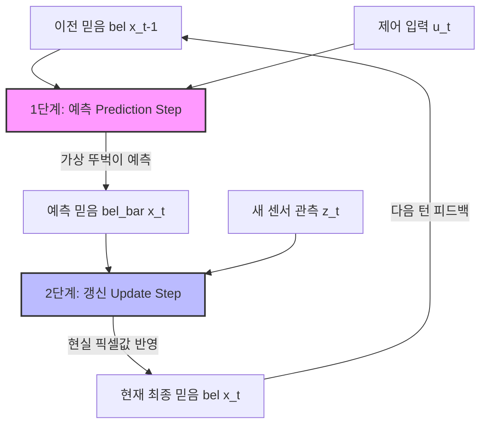

> 🌫️ **질문**: **"안개가 자욱하게 낀 어두운 밤, 목적지를 찾아 운전하고 있습니다. 내 차의 계기판 속도계(예측)는 시속 60km를 가리키고 있지만, 노이즈가 잔뜩 낀 채 삑삑거리는 스마트폰 GPS 화면(관측)은 내 차가 엉뚱한 풀숲을 달리고 있다고 소리칩니다. 이때 우리는 내 뇌피셜(예측)과 기계 센서(관측) 중 어느 쪽에 더 무게중심을 실어 진짜 내 위치를 찾아내야 할까요?"**
> 
> 현실 세계의 모든 지각과 센서 데이터는 피할 수 없는 노이즈(Noise) 범벅입니다. 이 지독한 불확실성 속에서 수학적으로 가장 완벽한 최적의 참값을 저울질해 뽑아내는 **베이즈 필터**와 **칼만 필터**의 황홀한 역학 관계를 마스터합니다.

---

## 1. 확률론적 상태 추정과 POMDP

에이전트(자율주행차, 로봇)가 실시간으로 안전하게 굴러가려면, 자신이 딛고 있는 물리 공간 속 상태를 끊임없이 인지해야 합니다. 이를 **상태 추정(State Estimation)**이라고 합니다.

우리는 이 문제를 **부분 관측 마르코프 결정 과정(POMDP, Partially Observable Markov Decision Process)**이라는 멋진 확률 그래프 모델로 정형화합니다.

```
       [ POMDP의 시간 축 진화 그래픽 모델 ]

       상태 전이 모델 P(x_t | x_{t-1}, u_t)
       
       (x_{t-1})  ───────────────>  ( x_t )  ───────────────> (x_{t+1})  <─── 진짜 상태 (은닉)
           │                          │                          │
           │                          │                          │
  제어 입력│u_{t-1}           제어 입력│u_t               제어 입력│u_{t+1}
           v                          v                          v
       [z_{t-1}]                  [ z_t ]                  [z_{t+1}]  <─── 센서 관측 (노이즈)
       
       관측 우도 모델 P(z_t | x_t)
```

### 1.1 핵심 정의 변수 삼총사
*   $x_t \in \mathbb{R}^n$: 시각 $t$에서의 숨겨진 **진짜 물리 상태 (Hidden State)**. *예: 차량의 진짜 3D 좌표와 속도.*
*   $z_t \in \mathbb{R}^k$: 시각 $t$에서 센서가 뱉어낸 **관측값 (Observation)**. *예: LiDAR 포인트 클라우드, 카메라 이미지 픽셀.*
*   $u_t \in \mathbb{R}^m$: 시각 $t$에 차에 전달한 가속/조향 등의 **제어 입력 (Control Input)**.

에이전트가 손에 쥔 정보는 과거부터 지금까지의 모든 제어 명령 이력 $u_{1:t}$와 센서 측정값 $z_{1:t}$뿐입니다. 이 주어진 정보들을 가동하여 은닉 상태 $x_t$의 사후 분포를 추적해내는 것, 즉 **믿음(Belief, $\text{bel}(x_t)$)**을 완성하는 것이 상태 추정기의 숙명입니다.

$$\text{bel}(x_t) = p(x_t \mid z_{1:t}, u_{1:t}) \tag{1}$$

---

## 2. 베이즈 필터 (Bayes Filter)

베이즈 필터는 매 순간 태초의 모든 기록($z_{1:t}, u_{1:t}$)을 끄집어내 복습하지 않고, 오직 **"직전 단계의 믿음 $\text{bel}(x_{t-1})$, 새로운 제어 명령 $u_t$, 새로운 센서값 $z_t$"** 이 세 가지만을 활용해 현재의 믿음 $\text{bel}(x_t)$을 재귀적으로 잽싸게 갱신하는 실시간 최적화의 교과서입니다.



### 2.1 🔄 친절한 비유 (눈 감고 뚜벅이, 눈 뜨고 현실 자각)

베이즈 필터는 매 턴마다 두 박스의 춤을 춥니다.

1.  **예측 단계 (Prediction Step: 눈 감고 상상 걷기)**:
    눈을 질끈 감습니다. 직전 위치($x_{t-1}$)에서 액셀을 밟은 제어값($u_t$)과 내 차의 물리적 동역학 모델(Transition Model)만을 머릿속으로 굴려 *"아, 아마도 난 지금 이만큼 와 있겠군!"* 하고 상상의 나라를 펼치는 단계입니다. 아무래도 눈을 감고 있으니 시간이 흐를수록 불확실성(분산)의 안개가 스멀스멀 피어오릅니다.
2.  **갱신 단계 (Update Step: 눈 뜨고 현실 교정)**:
    이제 눈을 번쩍 뜹니다! 그 순간 카메라와 LiDAR에서 화려한 픽셀 데이터(관측 $z_t$)가 쏟아져 들어옵니다. 방금 전 눈 감고 상상했던 내 가상 위치(예측 믿음)와 실제 눈앞에 보이는 랜드마크 센서값(우도 $p(z_t \mid x_t)$)을 베이즈 정리로 퓨전하여, 머릿속 지도를 현실에 맞게 가장 유력한 위치로 칼같이 교정(Update)합니다.

---

### 2.2 수학적 유도 과정 완전 해부

베이즈 규칙(Bayes' Rule)과 마르코프 성질을 가동하여 이 아름다운 2단계 루프를 수학적으로 유도해 봅시다.

#### 1단계: 예측 단계 (Prediction Step)
우리가 구하려는 예측 믿음 $\overline{\text{bel}}(x_t) = p(x_t \mid z_{1:t-1}, u_{1:t})$는, 직전 시점 상태 $x_{t-1}$을 매개로 삼아 식 전체를 주변화(Marginalization)하여 유도해 냅니다.

$$\overline{\text{bel}}(x_t) = \int_{x_{t-1}} p(x_t \mid x_{t-1}, u_t) \cdot \text{bel}(x_{t-1}) \, dx_{t-1} \tag{2}$$

*   $p(x_t \mid x_{t-1}, u_t)$: 제어 명령 $u_t$를 받았을 때 상태가 어떻게 전이되는지 기술하는 **상태 전이 모델 (State Transition Model)**.
*   $\text{bel}(x_{t-1})$: 이전 단계가 훌륭하게 추정해낸 최종 결과물 사후 분포.

#### 2단계: 갱신 단계 (Update Step)
새로운 관측값 $z_t$가 드디어 들어왔습니다. 베이즈 정리를 들이밀어 사후 확률을 수식으로 쪼갭니다.

$$\text{bel}(x_t) = p(x_t \mid z_{1:t}, u_{1:t}) = \frac{p(z_t \mid x_t) \cdot \overline{\text{bel}}(x_t)}{p(z_t \mid z_{1:t-1}, u_{1:t})} \tag{3}$$

분모인 $p(z_t \mid z_{1:t-1}, u_{1:t})$는 사후 확률의 총합이 $1$이 되도록 나누어주는 정수 형태의 **정규화 상수 $\eta$**로 치환할 수 있으므로, 최종 갱신 식은 매우 직관적으로 단출해집니다.

$$\text{bel}(x_t) = \eta \cdot p(z_t \mid x_t) \cdot \overline{\text{bel}}(x_t) \tag{4}$$

*   $p(z_t \mid x_t)$: 현재 상태 $x_t$일 때 센서값 $z_t$가 관측될 확률인 **측정 우도 모델 (Measurement Likelihood)**.
*   $\overline{\text{bel}}(x_t)$: 1단계에서 눈 감고 예측해 둔 소중한 밑바탕 믿음.

---

## 3. 칼만 필터 (Kalman Filter) : 선형-가우스 세계의 신화

베이즈 필터는 이론적으로 완벽하지만, 상태 공간이 연속적일 경우 정규화 상수 분모를 구하기 위해 우주 끝까지 **적분($\int$)을 수행해야 하는 수학적 파탄**에 직면합니다. 

이 적분 연산을 단 0.001초 만에 완료되는 **사칙연산 행렬식으로 해방**시켜준 천재적인 필터가 바로 **칼만 필터(Kalman Filter)**입니다. 칼만 필터는 세상에 단 두 가지의 강력한 축복(제약)을 선물합니다.

```
                  [ 칼만 필터가 약속하는 가우스 평화 지대 ]
                  
     1. 선형성 (Linearity)                         2. 가우스 분포 (Gaussian)
     A_t x_{t-1} + B_t u_t                         모든 노이즈와 상태는 예쁘게
     기하학이 찌그러지지 않고 곧게 보존됨              좌우 대칭인 종 모양(Normal)을 유지함
```

1.  **선형 전이/관측**: 시스템의 물리 법칙 $f(\cdot)$와 센서 관측 $h(\cdot)$는 완벽하게 곧게 뻗은 일차식(선형 행렬 연산)이다.
2.  **모든 것은 가우스 분포**: 상태, 센서 잡음, 과정 불확실성 등 세상 모든 확률적 흔들림은 아름답게 종 모양을 그리는 다변량 가우스 분포 $\mathcal{N}(\mu, \Sigma)$를 따른다.

$$x_t = A_t x_{t-1} + B_t u_t + w_t, \quad w_t \sim \mathcal{N}(0, Q_t) \tag{5}$$

$$z_t = C_t x_t + v_t, \quad v_t \sim \mathcal{N}(0, R_t) \tag{6}$$

*   $A_t$: 상태 전이 행렬, $B_t$: 제어 입력 가중 행렬, $C_t$: 측정 가중 행렬.
*   $Q_t$: 물리 시스템 자체의 예측 흔들림 공분산 행렬 (Process Noise Covariance).
*   $R_t$: 기계 센서 자체의 불안정함 공분산 행렬 (Measurement Noise Covariance).

초기 조건 $x_0 \sim \mathcal{N}(\mu_{0 \mid 0}, \Sigma_{0 \mid 0})$에서 출발한 가우스 고무찰흙은, 선형 행렬 연산($A_t, C_t$)을 통과해도 **영원히 찌그러지지 않고 완벽한 가우스 분포**를 유지합니다. 덕분에 우리는 복잡한 연속 확률 분포 식을 다 버리고, 오직 분포의 중심점인 **평균 벡터 $\mu$**와 분산의 범위인 **공분산 행렬 $\Sigma$** 단 두 개만 폐쇄형 방정식(Closed-form Equation)으로 업데이트하면 추정이 끝납니다!

---

### 3.1 칼만 필터 방정식 일람

#### [ 예측 단계 (Prediction Step) ]
이전 평균과 공분산을 시스템 기하학으로 밀어내어 선행 예측을 진행합니다.

$$\mu_{t \mid t-1} = A_t \mu_{t-1 \mid t-1} + B_t u_t \tag{7}$$

$$\Sigma_{t \mid t-1} = A_t \Sigma_{t-1 \mid t-1} A_t^T + Q_t \tag{8}$$

*   **해석**: 식 (8)에서 이전 불확실성 $\Sigma$에 상태 전이 가중치 $A_t A_t^T$가 곱해지고 물리 엔진 오차 $Q_t$가 추가로 더해집니다. 즉, **예측 단계에서는 불확실성(분산 크기)이 늘어납니다.**

#### [ 갱신 단계 (Update Step) ]
들어온 센서값 $z_t$로 머릿속 예측값을 영리하게 튜닝합니다.

$$\mu_{t \mid t} = \mu_{t \mid t-1} + K_t (z_t - C_t \mu_{t \mid t-1}) \tag{9}$$

$$\Sigma_{t \mid t} = \Sigma_{t \mid t-1} - K_t C_t \Sigma_{t \mid t-1} \tag{10}$$

$$K_t = \Sigma_{t \mid t-1} C_t^T (C_t \Sigma_{t \mid t-1} C_t^T + R_t)^{-1} \tag{11}$$

*   **혁신 (Innovation, $z_t - C_t \mu_{t \mid t-1}$)**: 진짜 눈으로 기계가 읽은 센서값 $z_t$와 내가 방금 상상했던 예측 센서값 사이의 차이(오차).
*   **칼만 이득 (Kalman Gain, $K_t$)**: 이 혁신(차이)을 내 평균값 수정에 몇 %나 적극적으로 반영할지 저울질하는 최고의 신뢰 가중치.

---

### 3.2 ⚖️ 친절한 비유 (칼만 이득 $K_t$의 밀당 시소게임)

칼만 이득 $K_t$의 수식 구조(식 11)는 얼핏 복잡해 보이지만, 기하학적 의미는 너무나 유쾌하고 단순합니다.

$$K_t \approx \frac{\text{내 상상 속의 불확실성 }(\Sigma_{t \mid t-1})}{\text{내 상상 속의 불확실성 }(\Sigma_{t \mid t-1}) + \text{기계 센서의 노이즈 불확실성 }(R_t)} \tag{12}$$

이 비율 $K_t$는 내 머릿속 불확실성과 기계 센서 노이즈 크기 사이의 처절한 **신뢰 시소게임**입니다.

```
  [ 극단 A: 센서가 신(神)급 퀄리티일 때 ]            [ 극단 B: 내 동역학 예측이 신(神)급일 때 ]
           (센서 잡음 R_t ──> 0)                            (내 머릿속 분산 Σ_t|t-1 ──> 0)
           
              [평균 예측]    [센서 관측]                       [평균 예측]    [센서 관측]
                 정신          신뢰                               신뢰          정신
                  ▲             ▲                                 ▲             ▲
                  │             │                                 │             │
             ─────┴─────────────■──────                      ──────■─────────────┴─────
             
          * 칼만 이득 K_t ──> C^{-1}                      * 칼만 이득 K_t ──> 0
          * 센서의 측정값 z_t를 100% 신뢰                 * 삑삑거리는 쓰레기 GPS 측정값 무시
          * 머릿속 상상 지도를 다 찢어버림                  * 오직 내 가속 물리 법칙으로만 무한 돌격!
```

*   **상황 A (기계 센서 잡음 $R_t \to 0$ 의 완벽함)**:
    폰 GPS 센서 성능이 우주 비행선 급이라 오차가 거의 제로입니다. 식 (12)에 의해 분모의 $R_t$가 소거되면서 $K_t$는 저울 추를 한쪽 끝으로 밀어내어 $C_t^{-1}$로 수렴합니다. 
    갱신 식 (9)에 대입하면 평균 $\mu_{t \mid t}$는 내 예측을 깔끔하게 무시하고 **오직 센서가 일러준 정답 좌표 $C_t^{-1} z_t$로 순간이동**해 버립니다.
*   **상황 B (내 동역학 예측 불확실성 $\Sigma_{t \mid t-1} \to 0$ 의 견고함)**:
    이미 내 차의 엔진 구동과 관성 물리 시뮬레이션의 정확도가 정밀 측정 수준으로 완벽합니다. 반면 내 스마트폰 GPS는 고장 나서 위치가 사방으로 튀고 난장판입니다. 
    식 (12)의 분자가 $0$이 되므로 칼만 이득 $K_t$는 과감하게 **$0$으로 수렴**합니다. 갱신 식 (9)에서 두 번째 텀이 시원하게 지워지며, 삑삑대는 불량 GPS 신호를 완벽하게 필터링하고 **오직 내 물리 예측 $\mu_{t \mid t-1}$만으로 자율주행 직진**을 성취합니다.

---

## 4. 확장 칼만 필터 (EKF, Extended Kalman Filter) : 곡선 세계의 임시방편

불행히도 우리가 살아가는 현실 3D 기하는 선형적이지 않습니다. 자율주행 차가 커브를 돌 때 속도와 헤딩 각도는 삼각함수($\sin \theta, \cos \theta$)로 엮이며, 3D 카메라 핀홀 투영 식 역시 나눗셈($/Z$)이 들어간 지독한 **비선형(Non-linear) 모델**입니다.

가우스 분포의 찰흙을 이 구불구불한 비선형 함수 렌즈에 통과시켜 반대편으로 내보내면, 슬프게도 아름다웠던 종 모양이 사정없이 찌그러지고 갈가리 찢어져 **비가우스(Non-Gaussian) 분포로 타락**해 버립니다. 칼만 필터의 대전제가 붕괴되는 것입니다.

```
       [ 비선형 렌즈를 통과해 찢어지는 가우스 분포 ]

       입력 가우스 분포 ───> [ 비선형 곡선 렌즈 f(x) ] ───> 찌그러진 가우스 분포 (붕괴!)
          (종 모양)              (나눗셈, 삼각함수)            (평균과 분산만으로 표현 불가능)
```

이 위기를 넘기기 위해 엔지니어들은 **확장 칼만 필터 (EKF, Extended Kalman Filter)**라는 절묘한 접선 돌파구를 마련해 냅니다.

> 🔎 **친절한 비유 (비선형 언덕길에 평평한 선형 접선 테이프 붙이기)**
> 
> "거대하게 휘어 올라가는 롤러코스터 비선형 선로 $f(x)$가 눈앞에 펼쳐져 있습니다. 
> 
> 이 롤러코스터 궤적 전체를 선형으로 퉁치는 것은 불가능하지만, **바로 지금 내 차 바퀴가 닿아있는 극소 영역(현재 평균 $\mu_{t-1 \mid t-1}$ 주변)**에 돋보기를 대고 초밀착해서 들여다봅니다. 
> 
> 아주 미세하게 들여다본 그 찰나의 구간만큼은 선로 역시 마치 하나의 곧은 평면처럼 보일 것입니다. 그 찰나의 발밑 경사도(기울기)를 구해 **평평한 직선 접착테이프(1차 테일러 전개 선형화)**를 딱 붙이고 연산을 수행한 뒤, 다음 발걸음에서 또 새로운 테이프를 붙여나가며 곡선 세계를 정복합니다."

이때 붙이는 임시방편 접선 테이프의 다차원 경사도 행렬이 바로 대학 수학의 **야코비안(Jacobian) 행렬**입니다.

$$A_t = \frac{\partial f(x, u_t)}{\partial x}\bigg|_{x = \mu_{t-1 \mid t-1}} \tag{13}$$

$$C_t = \frac{\partial h(x)}{\partial x}\bigg|_{x = \mu_{t \mid t-1}} \tag{14}$$

*   **주의**: 예측 평균을 밀어낼 때와 센서 혁신(오차)을 구할 때는 원래의 비선형 함수 $f(\cdot), h(\cdot)$에 직접 대입하여 계산하지만, **공분산 $\Sigma$을 변환하고 칼만 이득 $K_t$을 계산하기 위해 곱해주는 기하학적 가중치에만 야코비안 행렬 $A_t, C_t$를 대입**하여 표준 칼만 필터 루프를 재활용합니다.

---

## 5. KF vs EKF 아키텍처의 완벽 대조

| 비교 항목 | 칼만 필터 (Kalman Filter) | 확장 칼만 필터 (EKF) |
|:---:|:---|:---|
| **가정 공간** | 완벽히 평평한 선형(Linear) 공간 | 구부러진 비선형(Non-linear) 물리 공간 |
| **상태 전이 모델** | $x_t = A_t x_{t-1} + B_t u_t + w_t$ | $x_t = f(x_{t-1}, u_t) + w_t$ (비선형 함수) |
| **측정 관측 모델** | $z_t = C_t x_t + v_t$ | $z_t = h(x_t) + v_t$ (비선형 함수) |
| **선형화 과정** | 전혀 필요 없음 (태생적으로 평평함) | 매 턴마다 현재 위치에서 **야코비안** 계산 |
| **예측 평균 ($\mu_{t \mid t-1}$)** | $A_t \mu_{t-1 \mid t-1} + B_t u_t$ | $f(\mu_{t-1 \mid t-1}, u_t)$ |
| **갱신 혁신 (오차)** | $z_t - C_t \mu_{t \mid t-1}$ | $z_t - h(\mu_{t \mid t-1})$ |
| **공분산 전이 ($\Sigma$)** | $A_t \Sigma_{t-1 \mid t-1} A_t^T + Q_t$ | $A_t \Sigma_{t-1 \mid t-1} A_t^T + Q_t$ *(단, $A_t$는 Jacobian)* |

---

## 핵심 요약 및 확률론적 상태 추정 로드맵

```
  ┌─────────────────────────────────────────────────────────────────────────┐
  │                           확률론적 상태 추정 요약                       │
  └─────────────────────────────────────────────────────────────────────────┘
                                       │
        ┌──────────────────────────────┴──────────────────────────────┐
        ▼                                                             ▼
  [ 베이즈 필터 (Bayes Filter) ]                                  [ 이산 베이즈 필터 ]
  - POMDP 은닉 상태 사후확률bel(x) 추적                            - 연속 적분을 유한 합(Sum)으로 치환
  - 예측(눈 감고) + 갱신(눈 뜨고) 루프                            - 격자 그리드 및 히스토그램 필터화
  - 연속 적분 계산 불가능(Intractable)의 한계                      - 연립행렬식 곱 계산으로 연산 속도화
        │                                                             │
        └──────────────────────────────┬──────────────────────────────┘
                                       ▼
                          [ 칼만 필터 (Kalman Filter) ]
                          - 선형-가우스(Linear-Gaussian) 제약의 축복
                          - 적분 연산 생략 ──> (평균 μ, 공분산 Σ)만 추적
                          - 최소평균제곱오차(MMSE) 기준 최고 존엄의 최적 최적해
                                       │
                                       ├──────────────────────────────┐
                                       ▼                              ▼
                               [ 칼만 이득 K_t ]               [ 확장 칼만 필터 (EKF) ]
                               - 예측 불확실성 vs 센서 노이즈  - 비선형 공간(실제 기하)의 수용
                               - 0에 수렴: 예측 100% 신뢰      - 1차 테일러 전개 야코비안 선형화
                               - C^{-1}에 수렴: 센서 100% 신뢰  - 강한 비선형성 시 필터 붕괴 위험
```
