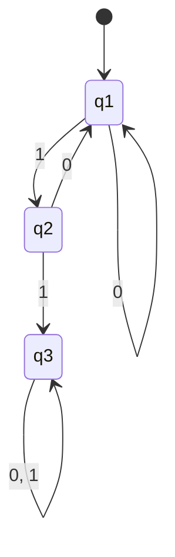

컴퓨터 과학을 공부하다 보면 이런 근본적인 질문에 마주하게 됩니다.
> **"컴퓨터가 풀 수 있는 문제와 풀 수 없는 문제는 무엇일까?"**
> **"문제를 푸는 데 얼마나 많은 시간과 메모리가 필요할까?"**

이러한 핵심 질문들에 수학적으로 답하고자 하는 학문이 바로 **계산 이론(Theory of Computation)**입니다. 이 글은 MIT의 세계적인 석학 마이클 십서(Michael Sipser) 교수님의 강의와 [강의 슬라이드](file:///Users/yeongjun/Develops/develop/static/references/theory-of-computation/lecture-01-introduction-finite-automata-regular-expressions.pdf)를 바탕으로, 가장 단순하지만 강력한 컴퓨터 모델인 **유한 오토마타(Finite Automata)**와 **정규 언어(Regular Language)**에 대해 정리합니다.

---

## 1. 컴퓨터 과학의 이론적 기원: 계산 가능성과 복잡도

본격적인 내용에 앞서 계산 이론의 큰 두 축을 먼저 짚고 넘어가면 이해에 도움이 됩니다.

1. **계산 가능성 이론 (Computability Theory, 1930~1950년대)**
   - "무엇이 계산 가능하고, 무엇이 계산 불가능한가?"를 다룹니다.
   - 대표적으로 튜링 머신(Turing Machine) 모델과 멈춤 문제(Halting Problem)처럼 아무리 좋은 슈퍼컴퓨터라도 절대 풀 수 없는 문제가 존재함을 증명합니다.
2. **계산 복잡도 이론 (Complexity Theory, 1960년대~현재)**
   - "이론적으로 풀 수 있는 문제 중, **실제(현실)로** 풀 수 있는 문제는 무엇인가?"를 다룹니다.
   - 컴퓨터 자원(시간, 메모리 공간)의 한계를 연구하며, 컴퓨터 과학 최대의 난제인 **P vs NP 문제**가 여기에 속합니다.

오늘 다룰 **유한 오토마타**는 계산 가능성 이론을 시작하기 위한 가장 기초적이면서도 직관적인 모델입니다.

---

## 2. 가장 단순한 컴퓨터: 유한 오토마타 (Finite Automata)

**유한 오토마타(Finite Automaton)**는 가질 수 있는 **상태(State)**의 개수가 유한하고, 입력값에 따라 상태가 바뀌는 아주 단순한 기계를 말합니다. 

쉽게 상상해 볼까요? 우리 주변의 **'전등 스위치'**를 생각해 봅시다.
- 전등은 **[꺼짐(Off)]**과 **[켜짐(On)]**이라는 두 가지 상태만 가질 수 있습니다.
- 스위치를 누르는 행동(입력)에 따라 `[꺼짐] → [켜짐]` 혹은 `[켜짐] → [꺼짐]`으로 상태가 변합니다.

이것이 유한 오토마타의 기본 개념입니다. 컴퓨터 과학에서는 이를 조금 더 확장하여 특정 패턴의 문자열을 판별하는 탐지기로 사용합니다.

### 2.1 문자열 판별기 $M_1$ 예시

강의에 등장하는 자동자 $M_1$의 작동을 직접 살펴봅시다. $M_1$은 **"11"이라는 문자열이 포함되어 있는지 검사하는 기계**입니다.

- **상태 ($q_1, q_2, q_3$)**:
  - $q_1$: 시작 상태입니다. 아직 연속된 1을 만나지 못했습니다.
  - $q_2$: 방금 `1`을 하나 읽은 상태입니다. 다음 글자가 `1`이면 성공입니다.
  - $q_3$: 드디어 연속된 `11`을 완성한 상태입니다. 이 상태는 이중 동그라미로 표시하며, 이를 **수락 상태(Accept State)**라고 부릅니다. 일단 $q_3$에 도달하면 이후에 어떤 입력이 오더라도 계속 $q_3$에 머무릅니다.

- **작동 과정 예시**:
  - 입력이 `01101`인 경우:
    - 시작 $q_1$ $\xrightarrow{0}$ $q_1$ $\xrightarrow{1}$ $q_2$ $\xrightarrow{1}$ $q_3$ $\xrightarrow{0}$ $q_3$ $\xrightarrow{1}$ $q_3$
    - 마지막 상태가 수락 상태($q_3$)이므로 이 문자열을 **수락(Accept)**합니다.
  - 입력이 `00101`인 경우:
    - 시작 $q_1$ $\xrightarrow{0}$ $q_1$ $\xrightarrow{0}$ $q_1$ $\xrightarrow{1}$ $q_2$ $\xrightarrow{0}$ $q_1$ $\xrightarrow{1}$ $q_2$
    - 마지막 상태가 $q_2$(일반 상태)이므로 이 문자열은 **거부(Reject)**합니다.

이렇게 기계가 수락하는 모든 문자열의 집합을 그 기계의 **언어(Language)**라고 부르며, $L(M_1)$로 표기합니다.

---

## 3. 유한 오토마타의 수학적 정의 (5-Tuple)

수학자들은 유한 오토마타를 명확하게 다루기 위해 다음과 같이 **5가지 요소(5-Tuple)**로 정의합니다.

$$M = (Q, \Sigma, \delta, q_0, F)$$

1. **$Q$ (상태 집합)**: 기계가 가질 수 있는 모든 상태의 목록입니다. (예: $\{q_1, q_2, q_3\}$)
2. **$\Sigma$ (알파벳)**: 기계가 입력받을 수 있는 문자들의 집합입니다. (예: 이진수 문자열의 경우 $\{0, 1\}$)
3. **$\delta$ (전환 함수)**: 현재 상태에서 어떤 문자를 읽었을 때 다음 상태가 어디가 되는지 알려주는 지도입니다. 수학적으로는 $Q \times \Sigma \to Q$로 씁니다.
4. **$q_0$ (시작 상태)**: 기계가 켜졌을 때 제일 처음 위치하는 상태입니다. ($q_0 \in Q$)
5. **$F$ (수락 상태 집합)**: 최종 결과가 이 상태들 중 하나로 끝나면 문자열을 통과시키는 상태들의 모음입니다. ($F \subseteq Q$)

위에서 살펴본 $M_1$을 수학적으로 적어보면 다음과 같습니다:
- $Q = \{q_1, q_2, q_3\}$
- $\Sigma = \{0, 1\}$
- 시작 상태 = $q_1$
- $F = \{q_3\}$
- 전환 함수 $\delta$는 아래와 같은 매핑 표로 표현됩니다.
  - $\delta(q_1, 0) = q_1$, $\delta(q_1, 1) = q_2$
  - $\delta(q_2, 0) = q_1$, $\delta(q_2, 1) = q_3$
  - $\delta(q_3, 0) = q_3$, $\delta(q_3, 1) = q_3$

---

## 4. 정규 언어(Regular Language)와 정규 표현식(Regular Expression)

어떤 언어(문자열의 집합)가 있을 때, **그 언어를 판별할 수 있는 유한 오토마타를 단 하나라도 설계할 수 있다면**, 우리는 그 언어를 **정규 언어(Regular Language)**라고 부릅니다.

이 정규 언어를 연산하고 표현하기 위해 수학자들은 3가지 **정규 연산(Regular Operations)**을 정의했습니다. 언어 $A$와 $B$가 있을 때:

1. **합집합 (Union, $A \cup B$)**: $A$에 속하거나 $B$에 속하는 모든 문자열.
2. **연결 (Concatenation, $A \circ B$)**: 앞부분은 $A$에서 가져오고, 뒷부분은 $B$에서 가져와 이어 붙인 문자열.
3. **스타 (Star, $A^*$)**: $A$에 있는 문자열들을 0번 이상 마음대로 이어 붙여서 만들 수 있는 모든 문자열 (항상 빈 문자열 $\epsilon$이 포함됩니다).

### 4.1 정규 표현식의 예
이 연산들을 기호로 깔끔하게 정리한 것이 개발자분들에게도 익숙한 **정규 표현식(Regular Expression)**입니다.
- $(0 \cup 1)^*$: 모든 이진 문자열
- $\Sigma^* 1$: `1`로 끝나는 모든 문자열
- $\Sigma^* 11 \Sigma^*$: `11`을 중간에 포함하는 모든 문자열 (앞서 보았던 $M_1$의 언어와 같습니다!)

---

## 5. 정규 언어의 '닫힘 성질(Closure Properties)'과 합집합 증명

수학에서 어떤 집합이 특정 연산에 대해 **"닫혀 있다(Closed)"**는 것은, 집합 안의 원소들끼리 연산을 수행한 결과 역시 무조건 그 집합에 속한다는 의미입니다. 
*예를 들어, 정수 집합은 더하기(+) 연산에 대해 닫혀 있습니다. (정수 + 정수 = 항상 정수)*

마찬가지로 계산 이론에서는 다음과 같은 중요한 정리를 배웁니다.
> **"두 언어 $A_1$과 $A_2$가 정규 언어라면, 이 둘을 합친 $A_1 \cup A_2$도 정규 언어이다."**

이를 증명하려면 어떻게 해야 할까요? **$A_1 \cup A_2$를 판별해 내는 새로운 유한 오토마타 $M$을 만들어 낼 수 있음**을 수학적으로 보여주면 됩니다.

### 5.1 곱집합 구성(Product Construction)을 통한 증명

$A_1$을 구별하는 오토마타 $M_1$과 $A_2$를 구별하는 오토마타 $M_2$가 있다고 합시다. 
문자열이 입력되었을 때, 이 문자열이 $M_1$ 혹은 $M_2$ 중 하나라도 통과하는지 검사하려면 **두 기계를 동시에 나란히 작동시키는 상상의 기계 $M$**을 설계해야 합니다.

이를 위해 새 기계 $M$의 상태를 두 기계 상태의 쌍(Pair)으로 정의합니다. 이를 **곱집합 구성(Product Construction)**이라고 합니다.

1. **상태 집합 $Q$**: $Q_1 \times Q_2$
   - 만약 $M_1$의 상태가 $k_1$개이고, $M_2$의 상태가 $k_2$개라면, 합집합 오토마타 $M$은 총 $k_1 \times k_2$개의 상태를 가지게 됩니다.
2. **시작 상태**: $(q_1, q_2)$ (각 기계의 시작 상태 쌍)
3. **전환 함수 $\delta$**: 어떤 글자 $a$를 읽었을 때, 쌍의 두 상태가 각각 기존 지도에 따라 동시에 움직입니다.
   - $\delta((q, r), a) = (\delta_1(q, a), \delta_2(r, a))$
4. **수락 상태 집합 $F$**: 합집합($\cup$)이므로 두 기계 중 **어느 하나라도** 수락 상태에 도달하면 최종 수락해야 합니다.
   - $F = (F_1 \times Q_2) \cup (Q_1 \times F_2)$
   - *참고: 만약 수락 상태를 $F_1 \times F_2$(둘 다 수락 상태여야 함)로 정의한다면, 이는 교집합($A_1 \cap A_2$)을 구별하는 오토마타가 됩니다.*

이 곱집합 구성을 통해 항상 합집합 오토마타를 만들어 낼 수 있으므로, **정규 언어는 합집합 연산에 대해 닫혀 있음**이 증명됩니다.

---

## 6. 다음 단계를 향한 질문: 연결(Concatenation) 연산의 한계

합집합의 증명은 명쾌하게 끝났지만, 두 언어를 이어 붙이는 **연결 연산(Concatenation, $A_1 \circ A_2$)**의 증명은 그리 쉽지 않습니다.

어떤 문자열 $w$가 $A_1 \circ A_2$에 속하는지 확인하려면, 문자열을 적절히 두 부분 $w = xy$로 쪼개어 앞부분 $x$는 $M_1$이 수락하고, 뒷부분 $y$는 $M_2$가 수락하는지 확인해야 합니다.

하지만 **기계는 문자열을 한 자씩 읽어나갈 뿐, 문자열 전체를 어디서 쪼개야 최적일지 미리 알 수 없습니다!** 
이 문제를 해결하기 위해 오토마타에 **'예측력'** 혹은 **'여러 선택지를 동시에 탐색하는 능력'**을 부여해야 하는데, 이것이 바로 다음 시간의 핵심 주제인 **비결정적 유한 오토마타(Nondeterministic Finite Automata, NFA)**의 탄생 배경입니다.
