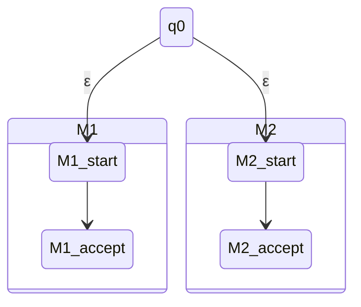

지난 1편에서는 가장 기초적인 컴퓨터 모델인 **DFA(결정적 유한 오토마타)**를 배웠고, 정규 언어가 합집합 연산에 대해 닫혀 있음을 증명했습니다.

하지만 두 언어를 이어 붙이는 **연결 연산(Concatenation, $A_1 \circ A_2$)**을 증명하려 할 때 큰 벽에 부딪혔습니다. 입력 문자열 $w$를 어디서 쪼개야($w=xy$) 앞부분은 $M_1$이, 뒷부분은 $M_2$가 수락할 수 있을지 DFA는 스스로 "추측"할 수 없기 때문입니다.

이 한계를 극복하기 위해 MIT 18.404J 강좌의 2번째 강의와 강의 슬라이드에서는 마법 같은 개념인 **비결정론(Nondeterminism)**을 도입합니다.

---

## 1. 비결정적 유한 오토마타 (NFA) 란 무엇인가?

우리가 지금까지 본 DFA는 매 순간 **단 하나의 다음 상태**로만 갈 수 있었습니다. 즉, 길이 정해져 있었습니다(Deterministic).

반면, **NFA(Nondeterministic Finite Automaton)**는 다음과 같은 두 가지 마법 같은 특징을 갖습니다:
1. **여러 개의 선택지**: 한 상태에서 어떤 문자 $a$를 읽었을 때, 다음 상태로 갈 수 있는 길이 여러 개(0개, 1개 또는 여러 개) 존재할 수 있습니다.
2. **$\epsilon$(이피실론) 전이 (Free Move)**: 아무런 입력 문자를 읽지 않고도 공짜로 다른 상태로 이동할 수 있습니다.

### NFA의 작동을 바라보는 세 가지 관점

현실 세계에서 오토마타를 작동시킬 때 NFA의 비결정성을 이해하는 세 가지 유용한 관점이 있습니다.

*   **컴퓨터 과학적 관점 (병렬 스레드)**: 선택지가 나뉠 때마다 기계가 복제되어 **여러 스레드가 동시에 작동**한다고 생각하는 것입니다. 스레드 중 단 하나라도 수락 상태에 도달하면 기계 전체가 문자열을 수락합니다.
*   **수학적 관점 (탐색 트리)**: 가능한 모든 경로를 가지치기(Branching)하는 트리 형태로 탐색하여, 리프 노드 중 하나라도 수락 상태를 포함하면 성공으로 판정합니다.
*   **마법사 관점 (완벽한 추측)**: 기계가 매 순간마다 수락 상태에 갈 수 있는 **최선의 길을 마법처럼 완벽하게 추측**하여 이동한다고 생각하는 것입니다. 수락할 수 있는 경로가 존재하기만 하면 기계는 무조건 그 경로를 찾아냅니다.

---

## 2. NFA의 수학적 정의

DFA와 마찬가지로 NFA 역시 **5-Tuple**로 정의되지만, **전환 함수 $\delta$**의 형태가 다릅니다.

$$N = (Q, \Sigma, \delta, q_0, F)$$

가장 큰 차이점은 전환 함수 $\delta$의 공역이 상태들의 **멱집합(Power Set, $\mathcal{P}(Q)$)**이라는 점입니다. 또한 입력 알파벳에 빈 문자 $\epsilon$이 추가된 $\Sigma_\epsilon = \Sigma \cup \{\epsilon\}$을 사용합니다.

$$\delta: Q \times \Sigma_\epsilon \to \mathcal{P}(Q)$$

즉, $\delta(q, a)$의 결과값은 단일 상태가 아니라 **이동 가능한 다음 상태들의 집합**이 됩니다. 만약 갈 수 있는 경로가 없다면 결과는 공집합($\emptyset$)이 됩니다.

---

## 3. NFA와 DFA의 동등성 (Converting NFAs to DFAs)

NFA는 동시에 여러 스레드를 돌리거나 마법처럼 다음 경로를 추측하는 강력한 기능을 가진 것처럼 보입니다. 그렇다면 NFA는 DFA보다 더 어려운 문제를 풀 수 있을까요?

놀랍게도 답은 **"아니오"**입니다. **NFA가 인식할 수 있는 모든 언어는 DFA로도 완벽하게 구현할 수 있습니다.**

### 부분집합 구성법 (Subset Construction)
NFA $M$을 동등한 DFA $M'$로 변환하는 핵심 아이디어는 **DFA가 NFA가 가질 수 있는 "가능한 상태들의 모든 부분집합"을 하나의 상태로 추적**하게 만드는 것입니다.

NFA의 상태 집합이 $Q$라면, DFA의 상태 집합 $Q'$는 $Q$의 모든 부분집합들의 집합인 멱집합 $\mathcal{P}(Q)$가 됩니다.
- 만약 NFA가 $n$개의 상태를 가졌다면, 이를 시뮬레이션하는 DFA는 최대 $2^n$개의 상태를 갖게 됩니다. (이를 **상태 폭발(State Explosion)**이라고 부릅니다.)

DFA의 각 컴포넌트는 다음과 같이 구성됩니다:
1. **상태 집합 $Q'$**: $\mathcal{P}(Q)$
2. **시작 상태 $q'_0$**: NFA의 시작 상태인 $q_0$에서 출발하여, $\epsilon$-전이만을 타고 갈 수 있는 모든 상태들의 집합 $E(\{q_0\})$
3. **수락 상태 집합 $F'$**: NFA의 수락 상태 중 하나라도 포함하고 있는 모든 부분집합 집합. ($R \cap F \neq \emptyset$)

이를 통해 모든 NFA는 이에 대응하는 DFA로 변환될 수 있으므로, **NFA가 인식하는 언어도 역시 정규 언어**임이 증명됩니다.

---

## 4. NFA를 이용한 닫힘 성질(Closure Properties)의 쉬운 증명

DFA만으로 증명하기 까다로웠던 정규 연산들의 닫힘 성질이, NFA와 $\epsilon$-전이를 사용하면 그림을 그리듯 매우 쉽게 증명됩니다.

### 4.1 합집합 (Union)
두 DFA $M_1$과 $M_2$가 있을 때, 새로운 시작 상태 $q_0$를 만들고 이 상태에서 $M_1$과 $M_2$의 시작 상태로 향하는 **$\epsilon$-전이** 화살표 두 개를 그려주면 끝납니다. 기계는 입력 문자열을 시작하자마자 공짜로 양쪽 스레드로 갈라져 탐색을 시작합니다.

### 4.2 연결 (Concatenation)
앞서 골머리를 앓았던 연결 연산($A_1 \circ A_2$)도 쉽게 해결됩니다. $M_1$의 모든 수락 상태에서 $M_2$의 시작 상태로 향하는 **$\epsilon$-전이** 화살표들을 그립니다. 그리고 $M_1$의 수락 상태들은 더 이상 최종 수락 상태가 아니게 만들고, 오직 $M_2$의 수락 상태만 최종 수락 상태로 둡니다.

이렇게 하면 $M_1$이 문자열의 앞부분을 성공적으로 읽어 수락 상태에 도달하는 매 순간마다, 기계는 **"뒷부분을 시작하기 위해 $M_2$로 넘어가는 선택지"**를 동시에 탐색하게 됩니다.

### 4.3 스타 연산 (Star)
언어 $A$를 0번 이상 반복하는 스타 연산($A^*$)은 다음과 같이 만듭니다:
1. 새로운 시작 상태 $q_0$를 만듭니다. (빈 문자열 $\epsilon$을 수락해야 하므로 $q_0$는 수락 상태가 됩니다.)
2. $q_0$에서 원래 기계의 시작 상태로 $\epsilon$-전이를 추가합니다.
3. 원래 기계의 모든 수락 상태에서 원래 시작 상태로 되돌아가는 $\epsilon$-전이를 추가하여 반복을 구현합니다.

---

## 5. 정규 표현식을 NFA로 변환하기 (Regex $\to$ NFA)

NFA가 정규 연산(합집합, 연결, 스타)에 대해 닫혀 있음을 증명했으므로, 우리는 **모든 정규 표현식을 기계적인 변환 과정을 거쳐 NFA로 조립**할 수 있게 되었습니다.

### 5.1 기본 블록 (Atomic)
가장 최소 단위의 정규 표현식들을 다음과 같이 오토마타로 변환합니다:
- **문자 $a$ ($R = a$)**: 하나의 화살표를 가진 오토마타 ($q_1 \xrightarrow{a} q_2$ [수락])
- **빈 문자열 ($R = \epsilon$)**: 스스로를 수락하는 단일 오토마타 ($q_1$ [수락])
- **공집합 ($R = \emptyset$)**: 아무것도 수락하지 않는 오토마타 ($q_1$ [일반])

### 5.2 조합 (Composite)
기본 블록들이 준비되면, 정규 표현식의 식에 따라 위에서 설계한 합집합, 연결, 스타 오토마타 구성 방법을 적용해 거대한 NFA로 합쳐 나갑니다.

예를 들어, 정규 표현식 $(a \cup ab)^*$는 다음과 같이 조립됩니다:
1. 기본 문자 $a$와 $b$의 NFA를 생성합니다.
2. $a$와 $b$를 연결하여 $ab$의 NFA를 만듭니다.
3. $a$의 NFA와 $ab$의 NFA를 합집합 구성으로 묶어 $a \cup ab$의 NFA를 만듭니다.
4. 마지막으로 스타 연산 구성을 적용하여 전체적인 루프와 신규 시작 상태를 붙여 $(a \cup ab)^*$를 판별하는 NFA를 완성합니다.

이 증명법은 정규 표현식으로 표현 가능한 모든 언어가 결국 **정규 언어**임을 증명해 주는 강력한 도구입니다.

---

## 요약 및 마치며

이번 강의를 통해 계산 이론의 아름다운 이정표를 하나 세웠습니다:
- **NFA**는 비결정론과 공짜 이동($\epsilon$-전이)을 통해 복잡한 탐색을 직관적으로 모델링합니다.
- NFA는 DFA와 비교했을 때 기능적으로 더 유연해 보이지만, **계산 능력(Power) 자체는 DFA와 완전히 동일**합니다.
- NFA를 사용하면 합집합, 연결, 스타 연산 하에 정규 언어가 닫혀 있음을 아주 간단하게 증명할 수 있습니다.
- 결과적으로 **모든 정규 표현식은 동일한 언어를 인식하는 유한 오토마타(NFA/DFA)로 변환할 수 있습니다.**

정규 언어의 탐색 능력이 유한 오토마타의 한계와 일치한다는 것을 보여주었으니, 이제 다음 질문이 우리를 기다립니다.
> **"그렇다면 유한 오토마타가 절대로 인식할 수 없는 언어는 어떻게 찾아내고 증명할까?"**

이 한계를 증명하는 강력한 도구인 **펌핑 렘마(Pumping Lemma)**에 대해 다음 글에서 알아보겠습니다!
