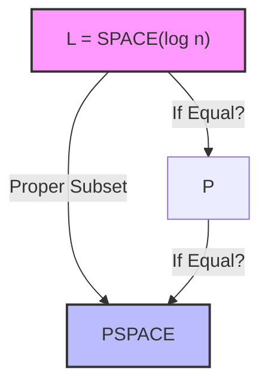

지난 19편(그리고 20편)에서는 로그 공간 복잡도 L과 NL, 그리고 비결정적 로그 공간 클래스가 여집합에 닫혀 있다는 NL = coNL 정리(임머만-셀레프체니 정리)의 개요에 대해 배웠습니다. 

이번 21번째 강의와 강의 슬라이드에서는 NL = coNL 증명의 정수인 '도달 가능한 노드 카운팅 기법'을 통해 증명을 완결 짓고, 컴퓨터에게 더 많은 시간이나 메모리가 주어지면 풀 수 있는 문제의 범주가 실제로 엄격하게 넓어짐을 보여주는 **시간 및 공간 계층 정리(Time and Space Hierarchy Theorems)**를 공부해 보겠습니다.

---

## 1. NL = coNL 증명의 완결 (Immerman-Szelepcsényi Theorem)

1987년 닐 이모먼(Neil Immerman)과 로베르트 스옙세니(Róbert Szelepcsényi)는 비결정적 공간 클래스가 여집합에 대해 닫혀 있다는 놀라운 정리인 **$\text{NL} = \text{coNL}$**을 독립적으로 발표했습니다. 이를 증명하기 위해선 경로가 존재하지 않음을 밝히는 문제인 **$\overline{\text{PATH}} \in \text{NL}$**임을 보이면 됩니다.

이 증명의 핵심 마법은 바로 **"도달 가능한 노드의 총 개수 $c$를 활용하는 카운팅 기법"**입니다.

### A. 핵심 개념: $c$가 주어지면 경로가 없음을 입증할 수 있다
시작 노드 $s$에서 도달할 수 있는 모든 노드의 집합을 $R$이라 하고, 이 집합의 크기를 $c = |R|$이라 합시다. 만약 어떤 예언자나 앞선 연산이 우리에게 **올바른 $c$의 값**을 던져준다면, 우리는 다항식 개수만큼 분기하는 비결정적 튜링 머신(NTM)을 사용해 $s$에서 $t$로 가는 경로가 **진짜로 존재하지 않는다(NO)**는 것을 다항 시간과 로그 공간 내에 증명해낼 수 있습니다.

> **$\text{path}(G,s,t) = \text{NO}$ 임을 확인하는 NL 알고리즘**
> 1. 도달 가능한 노드를 기록할 카운터 $k \leftarrow 0$으로 초기화합니다.
> 2. 그래프 $G$의 모든 노드 $u$에 대해 루프를 돕니다.
> 3. 각 노드 $u$에 대해 비결정적으로 다음 두 가지 갈림길 중 하나를 선택합니다:
>    - **(p) 직접 경로 검증**: $s$에서 $u$로 가는 길이 $\le m$(노드 수)인 경로를 비결정적으로 찍어서 찾아갑니다.
>      - 만약 경로를 찾는 데 성공하면 카운터 $k \leftarrow k+1$을 해줍니다.
>      - 만약 이때 찾아낸 $u$가 우리가 찾던 도착점 $t$라면, 경로가 존재하는 것이므로 즉시 알고리즘을 중단하고 **YES**를 출력합니다.
>    - **(n) 스킵**: 검증하지 않고 다음 노드로 넘어갑니다.
> 4. 모든 노드를 돌았을 때, **최종 카운터 $k$가 진짜 도달 가능한 노드 수 $c$와 일치하는지 검사**합니다 ($k \ne c$ 이면 reject).
> 5. 만약 $k = c$ 이면서 루프 도중 $t$를 만나지 못했다면, 우리는 모든 도달 가능한 노드($c$개)를 빠짐없이 전부 훑었음에도 그중에 $t$가 없었음을 확증한 것이므로 안심하고 **NO**를 출력합니다.

비결정론의 특징상 경로가 있는 경우는 쉽게 검증되지만, 경로가 **없는** 경우는 검증할 방법이 마땅치 않았습니다. 하지만 도달 가능한 전체 노드의 개수 $c$를 바운더리로 삼음으로써, "내가 검증한 도달 가능한 노드의 수($k$)가 전체 개수($c$)와 같으므로, 내가 확인하지 못한 다른 경로는 존재하지 않는다"는 것을 수학적으로 완벽히 보장할 수 있게 되었습니다.

### B. $c$는 어떻게 구하는가? 귀납적 카운팅 (Inductive Counting)
그렇다면 예언자가 던져준 $c$값은 어떻게 스스로 계산할 수 있을까요? 바로 단계를 쪼개어 차례대로 계산하는 **귀납법(Induction)**을 활용합니다.

- $R_d$: $s$에서 출발하여 $d$ 단계 이내에 도달할 수 있는 노드들의 집합.
- $c_d = |R_d|$: 그 집합의 크기.

1. **기초 단계**: $c_0 = 1$ 입니다. (0단계에서는 자기 자신 $s$만 도달할 수 있으므로)
2. **귀납 단계**: 이미 $c_d$ 값을 알고 있다고 가정하고, 이를 이용해 $c_{d+1}$ 값을 구합니다.
   - 모든 노드 $v$에 대해, $v \in R_{d+1}$ 인지 여부를 판정합니다. (즉, $s$에서 어떤 노드 $u \in R_d$로 가는 길이 $\le d$인 경로가 존재하고, 그 $u$에서 $v$로 가는 간선 $u \to v$가 존재하는지 비결정적으로 탐색)
   - 이때 $c_d$ 값을 한계선으로 삼아, 앞서 설명한 카운팅 기법을 똑같이 써서 $v \in R_{d+1}$ 인지 여부를 확실하게 판별할 수 있습니다.
   - 도달 가능한 것으로 판명된 $v$의 개수를 세어 $c_{d+1}$을 확정합니다.
3. **종료 단계**: $d = 0$부터 시작해 그래프 노드 수인 $m$까지 차례대로 구하면 최종적으로 $c_m = c$ 값을 획득할 수 있습니다.

이 모든 과정에서 필요한 메모리는 노드 인덱스($O(\log n)$)와 카운터 값($O(\log n)$) 수준이므로 오직 **로그 공간($O(\log n)$)** 내에서 완벽하게 구동됩니다. 

따라서 **$\overline{\text{PATH}} \in \text{NL}$** 이며, **$\text{NL} = \text{coNL}$** 정리가 최종적으로 완결됩니다.

---

## 2. 공간 계층 정리 (Space Hierarchy Theorem)

"튜링 머신에게 메모리를 더 많이 얹어주면, 실제로 더 어려운 문제를 풀 수 있는가?"
이 당연해 보이는 상식을 수학적으로 증명한 것이 바로 **계층 정리(Hierarchy Theorems)**입니다.

> **공간 계층 정리 (Space Hierarchy Theorem)**
> 임의의 공간 구성 가능(Space-constructible) 함수 $f: \mathbb{N} \to \mathbb{N}$에 대하여 다음이 성립합니다.
> 
> $$\text{SPACE}(o(f(n))) \subsetneq \text{SPACE}(f(n))$$

이 정리는 더 작은 공간 계층인 $o(f(n))$에선 절대 풀 수 없고, 오직 $O(f(n))$의 공간이 있어야만 풀 수 있는 언어가 반드시 존재한다는 것을 의미합니다. (즉, proper subset 관계입니다.)
*(참고: $f(n)$이 공간 구성 가능하다는 것은 $1^n$의 입력을 받아 $f(n)$의 이진 표기를 $O(f(n))$ 공간 내에 그릴 수 있는 합리적인 함수들(예: $n^2, 2^n$ 등)을 말합니다.)*

### 증명의 아이디어: 대각선 논법 (Diagonalization)
이 정리의 증명은 칸토어의 대각선 논법과 정지 문제(Halting Problem)의 불가능성 증명에 쓰인 패턴을 그대로 따릅니다.

우리는 다음과 같이 작동하는 결정적 튜링 머신 $D$를 설계합니다.

```
D = "On input w:
1. 입력의 길이 n = |w|에 대해 f(n)개의 테이프 셀을 마킹하여 경계를 긋는다.
   - 만약 계산 도중 이 영역을 벗어나려 하면 즉시 거부(Reject)한다.
2. 입력 w가 어떤 튜링 머신 M의 코드 ⟨M⟩이 아니라면 거부한다.
3. w = ⟨M⟩ 이라면, M을 w에 대해 시뮬레이션한다.
   - M이 f(n) 공간 이하를 쓰며 정지하고 수락하면 거부하고, 거부하면 수락한다."
```

이 기계 $D$는 설계상 $O(f(n))$ 공간 내에 완벽하게 정지하는 판정기이므로 $L(D) \in \text{SPACE}(f(n))$ 입니다.

이제 어떤 튜링 머신 $M$이 $o(f(n))$ 공간 내에 도는 임의의 판정기라고 가정해 봅시다. 
입력 $w$의 길이가 충분히 커지면, $D$가 가진 $f(n)$ 공간은 $M$이 사용하는 공간($o(f(n))$)을 시뮬레이션하고도 남을 만큼 널널해집니다. 이때 입력으로 $w = \langle M \rangle 10^*$을 대입하면:

- $D$는 $w$를 입력받아 $M$의 동작을 완벽히 모방한 뒤, **$M$과 정확히 반대되는 결과를 출력**합니다.
- 따라서 $L(D)$와 $L(M)$은 이 입력 $w$에서 결과가 무조건 달라지므로 두 언어는 결코 같을 수 없습니다.

즉, $o(f(n))$ 공간 내에 동작하는 그 어떤 튜링 머신도 $D$가 판정하는 언어를 똑같이 풀어낼 수 없습니다. 이로써 공간을 더 주면 풀 수 있는 문제가 엄격하게 확장됨이 증명됩니다.

---

## 3. 시간 계층 정리 (Time Hierarchy Theorem)

공간과 마찬가지로, 연산할 수 있는 시간 단계를 늘려주면 더 많은 문제를 풀 수 있게 됩니다.

> **시간 계층 정리 (Time Hierarchy Theorem)**
> 임의의 시간 구성 가능(Time-constructible) 함수 $f: \mathbb{N} \to \mathbb{N}$에 대하여 다음이 성립합니다.
> 
> $$\text{TIME}\left(o\left(\frac{f(n)}{\log f(n)}\right)\right) \subsetneq \text{TIME}(f(n))$$

### 시간 계층 정리에서 $\log f(n)$ 배만큼 손해를 보는 이유
공간 계층 정리에서는 $\text{SPACE}(o(f(n))) \subsetneq \text{SPACE}(f(n))$ 처럼 깔끔하게 떨어졌던 반면, 시간 계층 정리에서는 분모에 **$\log f(n)$**이라는 감쇄 인자가 붙습니다. 그 이유는 무엇일까요?

> [!IMPORTANT]
> **시뮬레이션의 시간적 오버헤드 (Logarithmic Overhead)**
> 대각선 논법 증명 과정에서 기계 $D$는 대상 튜링 머신 $M$을 직접 시뮬레이션해야 합니다. 
> 1. 시뮬레이션 기계 $D$는 테이프 수가 한정되어 있는 반면, 대상 $M$은 임의의 다수 테이프를 쓸 수 있습니다.
> 2. 다중 테이프 TM의 작동을 단일/2-테이프 TM으로 시뮬레이션하면서 연산 단계를 하나씩 따라갈 때, 현재 헤드의 위치와 단계 수 카운터를 매번 갱신하고 맞춰주어야 합니다.
> 3. 단계 카운터의 크기는 최대 $\log f(n)$ 비트이므로, 매 스텝마다 이 카운터를 헤드 근처로 옮기며 계산하는 데 **$O(\log f(n))$의 오버헤드가 곱하기 형태로 추가**됩니다.
> 
> 따라서 전체 시간을 $f(n)$ 내에 맞추어 시뮬레이션을 정상적으로 끝마치려면, 대상 기계 $M$의 시간 한도를 $\log f(n)$만큼 나눈 $o(f(n)/\log f(n))$ 수준으로 제한해야만 대각선 논법의 모순을 완벽히 유도할 수 있습니다.

---

## 4. 계층 정리의 임팩트와 미해결 난제들

계층 정리는 매우 명료한 수학적 정리를 선사하지만, 전산학 최고의 미해결 문제들을 푸는 데에는 묘한 교착 상태를 만들어냅니다.

> **Check-in 21.3: 계층 정리가 미해결 난제(L = P?, P = PSPACE?)에 대해 알려주는 것은 무엇인가?**
> - **답**: **"두 질문 중 최소한 하나는 결단코 거짓(NO)이다."**
> - **해설**: 
>   우리는 공간 계층 정리에 의해 다음이 성립함을 압니다.
>   $$\text{L} = \text{SPACE}(\log n) \subsetneq \text{SPACE}(n) \subseteq \text{PSPACE}$$
>   따라서 $\text{L} \subsetneq \text{PSPACE}$ 임은 수학적으로 확실하게 보장되어 있습니다. (proper subset)
>   만약 $\text{L} = \text{P}$와 $\text{P} = \text{PSPACE}$가 둘 다 참(YES)이라면, 삼단논법에 의해 $\text{L} = \text{PSPACE}$가 되어야 하는데 이는 방금 본 계층 정리에 모순됩니다. 따라서 **두 명제 중 적어도 하나는 무조건 성립하지 않아야(NO) 합니다.**



이처럼 계층 정리는 복잡도 클래스들 간의 격차($\text{L} \ne \text{PSPACE}$ 이거나 $\text{P} \ne \text{EXP-TIME}$)를 명확히 밝혀주지만, 정확히 **어느 경계선에서 격차가 벌어지는지(L과 P 사이인지, P와 PSPACE 사이인지)**는 구체적으로 짚어내지 못합니다. 이 구체적인 경계를 밝혀내는 것이 현대 복잡도 이론의 핵심 연구 분야입니다.

---

## 요약 및 마치며

- **$\text{NL} = \text{coNL}$** 정리는 시작점 $s$에서 도달 가능한 전체 노드의 개수 $c$를 구한 뒤, 빠짐없이 모든 경로를 확인하여 도착점 $t$가 없음을 입증하는 **귀납적 카운팅 기법**으로 완결됩니다.
- **공간 계층 정리**는 대각선 논법을 사용해 더 많은 메모리 공간이 주어지면 튜링 머신이 실제로 더 많은 문제를 풀 수 있음을 엄밀히 입증합니다.
- **시간 계층 정리** 역시 시간 단계가 늘어나면 해결 능력이 향상됨을 증명하지만, 다중 테이프 시뮬레이션 시 발생하는 로그 오버헤드로 인해 $\log f(n)$의 감쇄 비율이 추가됩니다.
- 계층 정리에 힘입어 $\text{L} \subsetneq \text{PSPACE}$ 임이 보장되므로, **$\text{L} = \text{P}$ 명제와 $\text{P} = \text{PSPACE}$ 명제 중 최소한 하나는 반드시 거짓(NO)**이라는 강력한 통찰을 얻을 수 있습니다.

계산 복잡도의 한계선들을 계층화하여 엄격하게 선을 긋는 대장정을 마쳤습니다. 다음 22번째 강의 요약에서는 컴퓨터가 절대 풀 수 없는 증명 불가능한 세계를 넘어, 오라클(Oracle) 머신과 상대적 계산 복잡도의 영역을 탐구해 보겠습니다!
